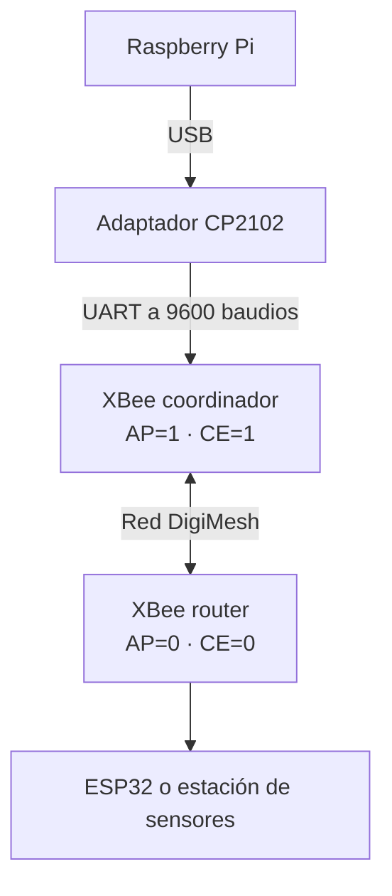

# Configuración de una red XBee-PRO 900HP DigiMesh

Herramienta interactiva en Python para configurar y comprobar módulos **XBee-PRO 900HP DigiMesh** desde una **Raspberry Pi**, mediante un adaptador USB-UART CP2102 y sin utilizar XCTU.

El programa permite leer la configuración de cada XBee, asignarle un nombre identificable, crear una red coordinador-router, descubrir los módulos que pertenecen a la misma red y conservar un registro local de los dispositivos configurados.

Este desarrollo forma parte de la plataforma de adquisición de datos del **Grupo G-LIMA**, en la que la comunicación XBee se estudia como una alternativa de enlace para estaciones o sensores que no disponen de conexión a Internet.

## Funciones principales

- Detecta los puertos seriales disponibles en la Raspberry Pi.
- Identifica cada XBee conectado mediante su parámetro `NI`.
- Lee la configuración actual del módulo sin modificarla.
- Detecta automáticamente si el XBee trabaja en modo transparente, API 1 o API 2.
- Configura los parámetros `ID`, `AP`, `CE` y `NI`.
- Guarda los cambios en la memoria no volátil del XBee mediante `WR`.
- Vuelve a leer el módulo y verifica que la configuración se haya aplicado correctamente.
- Descubre módulos remotos de la misma red mediante el comando `ND`.
- Muestra el nombre `NI`, la dirección MAC, el tipo de nodo y el RSSI informado durante el descubrimiento.
- Guarda en `xbee_configurados.json` los módulos configurados y el último descubrimiento realizado.

## Topología utilizada



La configuración recomendada para este proyecto es:

| Dispositivo | Función | `AP` | `CE` | Ejemplo de `NI` |
| --- | --- | ---: | ---: | --- |
| XBee conectado a la Raspberry Pi | Coordinador de mensajes indirectos | `1` | `1` | `COORDINADOR_RPI` |
| XBee conectado al ESP32 o sensor | Router estándar | `0` | `0` | `SENSOR_DISTANCIA` |

Todos los módulos que deban comunicarse tienen que compartir el mismo `ID` de red. Para que `ND` pueda encontrarlos, también deben ser compatibles los parámetros de radio, especialmente `HP` y `CM`.

## Contenido del repositorio

| Archivo | Descripción |
| --- | --- |
| `configurador_red_xbee_v1.py` | Primera versión funcional del configurador. |
| `configurador_red_xbee_v2.py` | Corrige la detección del modo serial: entrar con `+++` no implica necesariamente que `AP=0`. |
| `configurador_red_xbee_v3.py` | Versión recomendada. Añade la identificación por `NI` al listar puertos y mantiene el nombre del XBee visible en el menú. |
| `xbee_configurados.json` | Registro generado automáticamente después de configurar módulos o ejecutar un descubrimiento. |

## Requisitos

### Hardware

- Raspberry Pi con un sistema operativo basado en Linux.
- Uno o más módulos XBee-PRO 900HP con firmware DigiMesh compatible.
- Adaptador CP2102 USB-UART.
- Alimentación regulada adecuada para el XBee.

### Software

- Python 3.9 o posterior.
- Biblioteca `pyserial`.

El adaptador debe conectarse respetando las señales UART:

| CP2102 | XBee |
| --- | --- |
| `TXD` | `DIN` |
| `RXD` | `DOUT` |
| `GND` | `GND` |

No se debe alimentar el XBee con 5 V. Utilice una alimentación regulada de 3,3 V con capacidad de corriente suficiente o una placa adaptadora diseñada para el módulo.

## Instalación

Clone el repositorio y entre en su carpeta:

```bash
git clone https://github.com/tpalaciof/Configuracion-Red-Xbee.git
cd Configuracion-Red-Xbee
```

### Opción 1: entorno virtual

```bash
python3 -m venv .venv
source .venv/bin/activate
python -m pip install --upgrade pip
python -m pip install pyserial
```

### Opción 2: paquete del sistema en Raspberry Pi OS

```bash
sudo apt update
sudo apt install python3-serial
```

Para acceder al puerto serial sin ejecutar todo el programa con `sudo`, agregue el usuario al grupo `dialout`:

```bash
sudo usermod -aG dialout "$USER"
```

Después, cierre la sesión y vuelva a iniciarla para que el cambio tenga efecto.

## Ejecución

Ejecute la versión más reciente:

```bash
python3 configurador_red_xbee_v3.py
```

También puede indicar directamente el puerto y la velocidad serial actual del módulo:

```bash
python3 configurador_red_xbee_v3.py --puerto /dev/ttyUSB0 --baudios 9600
```

> El argumento `--baudios` indica la velocidad a la que el programa intentará comunicarse. No modifica el parámetro `BD` del XBee.

Al iniciar, el programa inspecciona los puertos disponibles e intenta leer el `NI` de cada XBee:

```text
Puertos seriales disponibles:
  1. /dev/ttyUSB0 - CP2102 USB to UART Bridge Controller | NI: COORDINADOR_RPI
  2. /dev/ttyUSB1 - CP2102 USB to UART Bridge Controller | NI: SENSOR_DISTANCIA
  3. Escribir otra ruta
```

La identificación puede tardar algunos segundos por puerto, debido a los tiempos de guarda que exige el modo de comandos AT.

Después de seleccionar un puerto aparece el menú principal:

```text
==========================================================
CONFIGURADOR DE RED XBEE-PRO 900HP DIGIMESH
==========================================================
Puerto actual: /dev/ttyUSB0 | 9600 baudios | NI: COORDINADOR_RPI

  1. Leer configuración del XBee local
  2. Configurar ID, AP, CE y NI
  3. Descubrir módulos de la misma red con ND
  4. Mostrar registro de módulos
  5. Cambiar puerto serial
  0. Salir
```

## Parámetros configurados

| Parámetro | Función | Valores admitidos por el programa |
| --- | --- | --- |
| `ID` | Identificador de la red DigiMesh | Hexadecimal entre `0x0000` y `0x7FFF` |
| `AP` | Modo de operación de la interfaz serial | `0`: transparente; `1`: API sin escapes; `2`: API con escapes |
| `CE` | Función del nodo dentro de la red | `0`: router estándar; `1`: coordinador de mensajes indirectos |
| `NI` | Nombre legible del módulo | Entre 1 y 20 caracteres ASCII, sin comas ni saltos de línea |

El programa también consulta, cuando el firmware lo permite, `SH`, `SL`, `VR`, `BD`, `HP`, `CM`, `DH` y `DL`. Estos valores se muestran como información de diagnóstico, pero no son modificados por el configurador.

## Configuración paso a paso de la red

### 1. Configurar el coordinador

1. Conecte a la Raspberry Pi el XBee que actuará como coordinador.
2. Ejecute `configurador_red_xbee_v3.py` y seleccione el puerto correspondiente.
3. Elija la opción `2`.
4. Asigne un `ID` de red, por ejemplo `0x1234`.
5. Configure `AP=1` y `CE=1`.
6. Asigne un `NI` reconocible, por ejemplo `COORDINADOR_RPI`.
7. Confirme la escritura.

El programa guarda los valores mediante `WR`, vuelve a abrir el puerto y verifica `ID`, `AP`, `CE` y `NI`.

### 2. Configurar un router

1. Desconecte el coordinador y conecte el XBee que estará asociado al ESP32 o a la estación de sensores.
2. Seleccione la opción `2`.
3. Introduzca exactamente el mismo `ID` utilizado en el coordinador.
4. Configure `AP=0` y `CE=0`.
5. Asigne un `NI` único, por ejemplo `SENSOR_DISTANCIA`.
6. Confirme la escritura y espere el mensaje de verificación satisfactoria.

Repita este procedimiento para cada router, utilizando un `NI` diferente.

### 3. Verificar la red

1. Mantenga encendidos los routers que desea descubrir.
2. Conecte nuevamente el coordinador a la Raspberry Pi.
3. Confirme mediante la opción `1` que el coordinador se encuentra en `AP=1` o `AP=2`.
4. Seleccione la opción `3` para ejecutar `ND`.

Por cada nodo remoto encontrado se muestra:

- Nombre `NI`.
- Dirección MAC formada por `SH:SL`.
- Tipo de nodo.
- RSSI informado por la respuesta de descubrimiento.
- RSSI del último salto, cuando el firmware y la opción `NO` lo incluyen.

El RSSI obtenido mediante `ND` corresponde al proceso de descubrimiento; no representa un monitoreo continuo de la calidad del enlace.

## Registro local

Después de una configuración satisfactoria, el programa crea o actualiza `xbee_configurados.json` en la misma carpeta del script. Cada módulo queda asociado a su dirección MAC para evitar registros duplicados.

El archivo conserva, entre otros datos:

- Dirección MAC.
- Nombre `NI`.
- `ID`, `AP` y `CE`.
- Función del módulo.
- Puerto serial utilizado.
- Fecha de configuración en la zona horaria `America/Bogota`.
- Resultado del último descubrimiento y RSSI de los nodos encontrados.

Ejemplo simplificado:

```json
{
    "version": 1,
    "actualizado": "2026-09-10T10:30:00-05:00",
    "modulos": [
        {
            "mac": "0013A200XXXXXXXX",
            "ni": "COORDINADOR_RPI",
            "id": "0x1234",
            "ap": 1,
            "ce": 1,
            "funcion": "Indirect Msg Coordinator",
            "puerto_usado": "/dev/ttyUSB0"
        }
    ]
}
```

## Funcionamiento interno

El configurador puede comunicarse con módulos en los tres valores de `AP` admitidos:

- En `AP=0`, entra al modo de comandos mediante `+++` y utiliza comandos AT en texto.
- En `AP=1`, construye y analiza tramas API sin escapes.
- En `AP=2`, construye y analiza tramas API con escapes.

Para las operaciones API se envía una trama **AT Command `0x08`** y se espera una **AT Command Response `0x88`**. En el descubrimiento, cada respuesta `0x88` asociada a `ND` contiene la información de un módulo encontrado; una respuesta final sin datos marca el cierre del proceso.

Cuando se cambia la configuración en modo API, `ID`, `CE` y `NI` se escriben y guardan primero. `AP` se cambia al final porque modifica inmediatamente la manera en que el XBee interpreta los bytes recibidos por UART. Después del cambio, el programa detecta otra vez el modo activo, ejecuta `WR` y relee los valores para verificarlos.

## Solución de problemas

### No aparece ningún puerto serial

Compruebe la detección del adaptador:

```bash
python3 -m serial.tools.list_ports -v
```

También puede revisar los puertos USB seriales con:

```bash
ls -l /dev/ttyUSB*
```

Si el usuario no tiene permiso para abrir el puerto, agréguelo al grupo `dialout` y vuelva a iniciar sesión.

### `ModuleNotFoundError: No module named 'serial'`

Instale `pyserial` con el mismo intérprete utilizado para ejecutar el programa:

```bash
python3 -m pip install pyserial
```

El paquete requerido se llama `pyserial`, aunque dentro del código se importa como `serial`.

### El XBee no responde

Revise lo siguiente:

- `TXD` y `RXD` deben estar cruzados con `DIN` y `DOUT`.
- La Raspberry, el CP2102 y el XBee deben compartir `GND`.
- El módulo debe tener alimentación estable de 3,3 V.
- El puerto seleccionado debe corresponder al adaptador correcto.
- La velocidad indicada con `--baudios` debe coincidir con el valor actual de `BD`.
- Ningún otro programa debe tener abierto el mismo puerto serial.

### El descubrimiento indica que el XBee local está en `AP=0`

La opción `3` utiliza tramas API `0x08/0x88`. Configure el XBee conectado a la Raspberry con `AP=1` o `AP=2`; para este proyecto se recomienda `AP=1`.

### `ND` no encuentra los routers

Compruebe que:

- Todos los módulos estén encendidos.
- Todos compartan el mismo `ID`.
- Los valores `HP` y `CM` sean compatibles.
- Los módulos utilicen firmware DigiMesh y una configuración de radio compatible.
- El XBee local esté configurado como coordinador con `CE=1`.
- Los módulos remotos estén configurados como routers con `CE=0`.

### Aparece `NI no disponible`

Este mensaje no significa necesariamente que el XBee esté dañado. Puede aparecer si el puerto pertenece a otro dispositivo, está ocupado, usa una velocidad diferente, no permite entrar temporalmente al modo de comandos o el módulo todavía no tiene un `NI` asignado.

## Alcance

El código fue desarrollado para **XBee-PRO 900HP DigiMesh**. Los comandos, límites y campos de `ND` pueden variar en otras familias XBee o en otros firmwares. Antes de utilizarlo con Zigbee, 802.15.4, DigiMesh de otra frecuencia u otro modelo, se deben comprobar los comandos AT admitidos por ese dispositivo.

El programa funciona completamente de manera local: no necesita conexión a Internet y no envía la configuración ni el registro a servicios externos.
