# Documentación técnica del configurador de redes XBee PRO 900HP DigiMesh

Esta documentación explica el funcionamiento del archivo `configurador_red_xbee_v6.5(2).py` del proyecto Grupo G-LIMA, desde la selección del puerto hasta la configuración remota y la recuperación de la red local. Está destinada tanto a quien opera el programa como a quien necesita comprender y mantener su implementación en Python.

El programa configura radios XBee; el receptor de mediciones del ESP32 es otro programa. El configurador usa comandos AT de texto para las operaciones locales y tramas API para descubrir nodos, visitar otras redes y configurar módulos remotos. Su funcionamiento depende de distinguir cuatro cosas: el formato de la comunicación UART, el estado de modo comando, la configuración de radio y los valores almacenados en memoria no volátil.

**Archivo examinado:** 2650 líneas. **Fecha de elaboración:** 2 de octubre de 2026. **Manual principal:** Digi *XBee-PRO 900HP/XSC RF Modules*, documento 90002173, revisión Y, septiembre de 2021.

La explicación se apoya en una lectura completa del código y del material pertinente del fabricante. Las comprobaciones realizadas para este documento son de análisis y simulación del procesamiento de bytes; no constituyen ensayos con los radios físicos. Los fragmentos del código se reproducen con fines explicativos. El archivo fuente suministrado no se modifica.

## Cómo usar este documento

Para comprender la base técnica, leer primero los capítulos 1 a 5. Para seguir una operación completa, consultar los capítulos de configuración local, descubrimiento y configuración remota. El catálogo del final permite localizar cada función y sus líneas de origen.

Las referencias **[M, p. n]** corresponden al [manual de Digi incluido en el paquete](fuentes/Manual_Digi_90002173_Y.pdf). La página impresa coincide con la posición de página del PDF utilizado. Las referencias **[C, Lx–Ly]** indican líneas del [código fuente incluido](fuentes/configurador_red_xbee_v6.5.py). **[P]** designa las capturas incluidas en `info_configurador_xbee(1).docx`.

El Markdown utiliza imágenes relativas dentro de `imagenes/`. Para conservar las figuras y abrir las referencias sin conexión, extraer el ZIP completo y mantener la estructura de carpetas. Los diagramas Mermaid complementarios requieren un visor compatible; las imágenes extraídas del manual son PNG y no dependen de Mermaid.

## Índice

- [1 Alcance y fuentes de la explicación](#seccion-1)
- [2 Montaje y recorrido de la información](#seccion-2)
- [3 Modos del XBee y conceptos que deben distinguirse](#seccion-3)
- [4 Parámetros AT y diferencias entre preparar aplicar y guardar](#seccion-4)
- [5 Requisitos arranque y organización general](#seccion-5)
- [6 Funciones básicas y selección del puerto](#seccion-6)
- [7 Comunicación local AT de texto](#seccion-7)
- [8 Lectura local y captura de nuevos valores](#seccion-8)
- [9 Configuración local completa](#seccion-9)
- [10 Estructura binaria de las tramas API](#seccion-10)
- [11 Comandos locales remotos y datos de sensores por API](#seccion-11)
- [12 Construcción lectura y asociación de tramas](#seccion-12)
- [13 Descubrimiento de nodos en la misma red](#seccion-13)
- [14 Búsqueda en intervalos y visitas temporales de red](#seccion-14)
- [15 Recuperación de ID y AP del XBee local](#seccion-15)
- [16 Selección y lectura de un módulo remoto](#seccion-16)
- [17 Configuración remota y cambios de red](#seccion-17)
- [18 Registro JSON y significado de sus datos](#seccion-18)
- [19 Interfaz terminal y estado visible](#seccion-19)
- [20 Procedimientos de operación y comprobación](#seccion-20)
- [21 Decisiones de diseño y límites que deben conservarse en la interpretación](#seccion-21)
- [22 Comprobación realizada para esta documentación](#seccion-22)
- [23 Catálogo de funciones y clases](#seccion-23)
- [24 Glosario de lectura del código](#seccion-24)
- [25 Fuentes trazabilidad y archivos incluidos](#seccion-25)

<a id="seccion-1"></a>

## 1 Alcance y fuentes de la explicación

<a id="seccion-1-1"></a>

### 1.1 Qué hace el configurador

| Operación | Medio utilizado | Resultado principal |
|---|---|---|
| Identificar el puerto y leer NI | UART y AT de texto | Ruta del puerto y nombre del XBee conectado |
| Preparar el arranque | AT de texto | GT de 500 ms y lectura del ID local |
| Leer configuración local | AT de texto | ID, AP, CE, NI, MAC y registros informativos |
| Configurar el módulo local | AT de texto, WR y lectura posterior | Cuatro parámetros guardados y comparados |
| Descubrir la red actual | API `0x08` con ND y respuestas `0x88` | Módulos que respondieron a la búsqueda |
| Buscar en un intervalo de ID | Cambio local temporal de ID y ND | Hallazgos por red y progreso del recorrido |
| Consultar otra red registrada | API local y AT remoto unicast | Disponibilidad actual de MAC ya conocidas |
| Configurar un remoto | API `0x17/0x97` | Escritura, guardado, aplicación y comparación posterior |
| Mantener registro | Archivo JSON | Últimos datos, descubrimientos e intentos pendientes |

El archivo no interpreta las mediciones de distancia o lluvia, no publica en ThingsBoard, no crea CSV de sensores y no modifica el programa del ESP32. Tampoco incorpora una interfaz gráfica: su interfaz es una terminal interactiva.

<a id="seccion-1-2"></a>

### 1.2 Cómo se resolvieron las diferencias entre fuentes

El código es la fuente de autoridad para describir qué se ejecuta. El manual es la fuente para explicar el protocolo y los registros. Los comentarios del código ayudan a entender la intención, pero una intención escrita no se considera automáticamente una garantía de comportamiento.

El documento Word aportado contiene **13 imágenes y no texto editable**. Doce son recortes técnicos y una es una captura del configurador. Por ello se revisaron sus imágenes, no solo la extracción de párrafos. Algunas capturas de estados y suspensión corresponden a la parte XSC del manual. La explicación de suspensión de este documento usa las páginas 52–56 de la parte **900HP**, para evitar trasladar parámetros de una familia a otra.

La captura del proyecto muestra una sesión con el nodo `NODO1`, una lectura remota y `RSSI no incluido`. Sirve para ilustrar un uso aportado por el usuario. No prueba todos los caminos de la versión examinada; incluso incluye la línea «Lectura», que en el código adjunto está comentada. [P; C, L757–798 y L2202–2220]

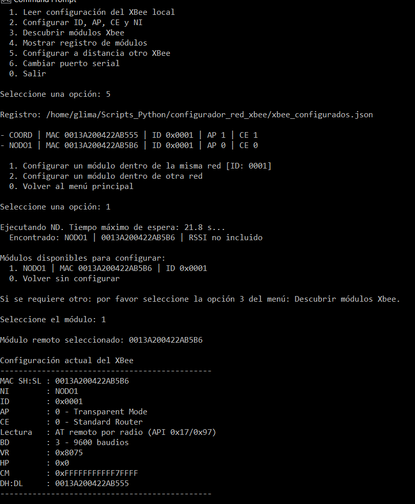

*Figura 1. Imagen original del documento del proyecto. Es evidencia aportada, no una captura generada durante esta revisión.*

<a id="seccion-1-3"></a>

### 1.3 Alcance de la compatibilidad

El programa está diseñado para XBee-PRO 900HP con el comportamiento de firmware previsto por el proyecto. No realiza una identificación formal del modelo antes de escribir GT ni comprueba `HV`, `BR` o todos los parámetros de compatibilidad de radio. Leer `VR` informa una versión; no establece por sí solo que cualquier equipo XBee sea compatible.

El manual reúne 900HP y XSC en un mismo PDF, pero son familias con apartados propios. Asimismo, las variantes de 10 kb/s y 200 kb/s de 900HP no ofrecen necesariamente las mismas funciones de red; DigiMesh está asociado a las funciones que el manual identifica para la variante correspondiente. Por ejemplo, la tabla de `TO` indica que el método DigiMesh no está disponible en el producto de 10 kb/s. [M, p. 87]

<a id="seccion-2"></a>

## 2 Montaje y recorrido de la información

<a id="seccion-2-1"></a>

### 2.1 Dos enlaces diferentes

En el montaje del proyecto, Python se comunica con un CP2102 conectado por USB a la Raspberry. El CP2102 convierte esa comunicación en UART hacia el XBee local. Entre los XBee existe un enlace RF. En el extremo remoto, otro UART conecta el radio con el ESP32.

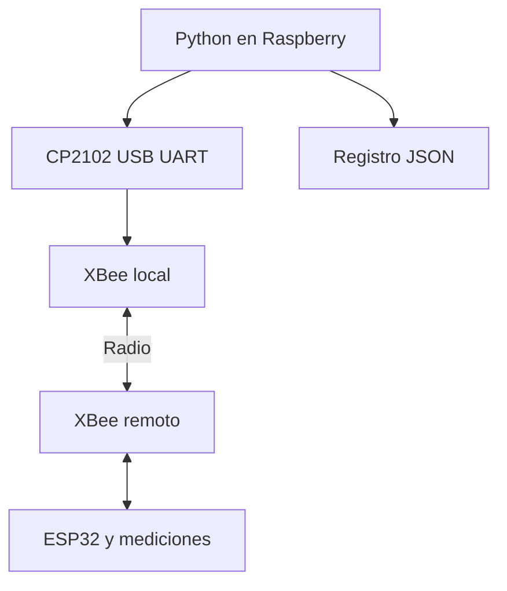
```mermaid
flowchart TD
    A["Python en Raspberry"] --> B["CP2102 USB UART"]
    B --> C["XBee local"]
    C <-->|"Radio"| D["XBee remoto"]
    D <--> E["ESP32 y mediciones"]
    A --> F["Registro JSON"]
```

**Los baudios del puerto no son la velocidad de radio.** `BAUDIOS=9600` configura la comunicación Raspberry–CP2102–XBee. La velocidad RF y la compatibilidad entre radios pertenecen a otra capa. Dos extremos de UART deben coincidir en su propia conexión; la Raspberry y el ESP32 no tienen que usar necesariamente la misma velocidad UART entre sí si cada uno coincide con su XBee.

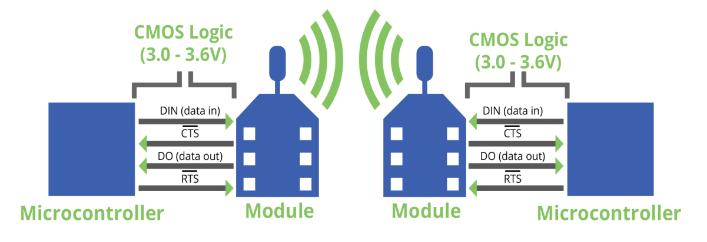

*Figura 2. Interfaz UART y enlace RF. Extraída de Digi 90002173 Y, p. 38. Las líneas de control del esquema ilustran capacidades del equipo; este código no habilita control de flujo RTS/CTS.*

<a id="seccion-2-2"></a>

### 2.2 Conexiones y alimentación

| Adaptador o anfitrión | XBee | Función |
|---|---|---|
| TX de UART | DIN, pin 3 del módulo | El anfitrión envía datos al radio |
| RX de UART | DOUT, pin 2 del módulo | El anfitrión recibe datos del radio |
| GND | GND | Referencia eléctrica común |
| Alimentación adecuada al módulo | VCC | Alimentación independiente de la interpretación de tramas |

El montaje requiere lógica y alimentación compatibles con el módulo, normalmente 3,3 V en este proyecto. No debe deducirse que cualquier salida de 3,3 V de un adaptador USB suministra la corriente suficiente para un XBee-PRO. El programa puede informar fallos de comunicación, pero no mide la alimentación ni diagnostica eléctricamente TX, RX o GND. La figura del fabricante sitúa la lógica en el rango mostrado en ella; los límites eléctricos deben consultarse para el hardware exacto. [M, p. 38]

<a id="seccion-2-3"></a>

### 2.3 Qué significa 9600 8N1

`abrirPuerto` selecciona 8 bits de datos, ninguna paridad y un bit de parada. Además del byte de datos, UART transmite un bit de inicio y el bit de parada. A 9600 bits/s, diez bits consumen aproximadamente 1,04 ms, por lo que 9600 baudios no significan 9600 bytes/s de contenido útil en esta configuración.

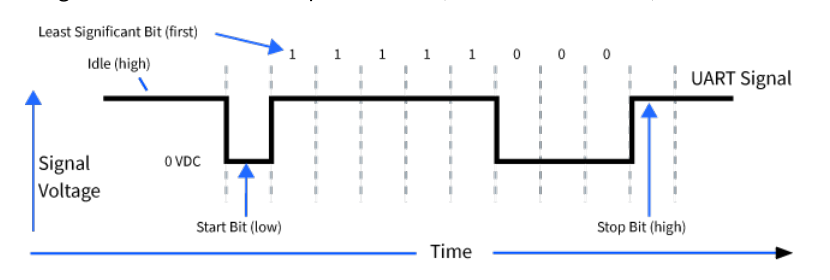

*Figura 3. Transmisión UART del byte 0x1F, Digi 90002173 Y, p. 38.*

El dibujo transmite los **bits del byte** empezando por el menos significativo. Esto no contradice que un número de **varios bytes** en una trama API se codifique en orden big-endian. Son dos órdenes distintos: bits dentro de un byte UART y bytes dentro de un campo del protocolo.

<a id="seccion-2-4"></a>

### 2.4 Un solo lector del puerto

El receptor de telemetría debe detenerse antes de iniciar el configurador. Ambos programas compiten por el mismo puerto y por sus bytes. El hecho de ser archivos Python separados no impide que se ejecuten al mismo tiempo, pero este diseño no coordina dos lectores simultáneos.

`abrirPuerto` no solicita acceso exclusivo mediante `exclusive=True` y no detecta ni detiene otro proceso. La exclusión se consigue mediante el procedimiento de operación. Durante API, el configurador puede recibir tramas de sensores, reconocer sus límites y descartarlas al no corresponder a la respuesta buscada. Eso no significa que conserve esas mediciones para el receptor.

<a id="seccion-3"></a>

## 3 Modos del XBee y conceptos que deben distinguirse

<a id="seccion-3-1"></a>

### 3.1 Los parámetros describen dimensiones diferentes

| Concepto | Qué controla | Valores pertinentes | Qué no significa |
|---|---|---|---|
| `AP` | Formato de la interfaz serial | 0, 1, 2 | No asigna el rol de coordinador |
| Modo comando | Interpretación temporal de caracteres UART como órdenes AT | Entrada por `+++`, salida por `CN` o CT | No es equivalente a `AP=0` |
| `CE` | Opciones de enrutamiento y mensajería indirecta | Campo de bits, el menú ofrece 0 y 1 | No es el modo de suspensión ni el formato API |
| `SM` | Suspensión y sincronización del radio | 0, 1, 4, 5, 7, 8 en 900HP | No es modificado por el configurador |
| `ID`, `HP`, `CM` | Compatibilidad y separación de redes RF | ID, preámbulo y canales | La igualdad de ID sola no basta |
| `TO` | Método y opciones de transmisión transparente | Punto a multipunto, difusión dirigida o DigiMesh según firmware | No es configurado por este menú |
| `AO` | Formato de las tramas de datos recibidos en API | `0x90` o `0x91` | No sustituye a AP |

<a id="seccion-3-2"></a>

### 3.2 Modo transparente con AP igual a cero

En operación transparente, el anfitrión escribe datos por DIN y el XBee los acumula para transmitirlos por radio. Cuando recibe datos RF, los entrega por DOUT. El anfitrión no necesita construir una trama API para enviar el texto de una medición. El destino se establece mediante `DH/DL` y las condiciones de transmisión mediante parámetros como `TO` y `RO`. [M, pp. 48, 86–87, 94]

Ejemplo conceptual: si el ESP32 escribe `DISTANCIA=1250\n`, esos bytes forman el contenido de la aplicación. El radio puede empaquetarlos según su temporización; no debe asumirse que cada `write()` del anfitrión crea exactamente un paquete RF ni que un `read()` del receptor entrega exactamente un mensaje completo.

`RO` establece un tiempo de silencio entre caracteres para decidir cuándo empaquetar datos. El manual también describe condiciones relacionadas con el máximo de carga útil y con la entrada en modo comando. Este configurador no modifica `RO`, `NP` ni el formato de los mensajes de sensores.

<a id="seccion-3-3"></a>

### 3.3 API sin escapes con AP igual a uno

API convierte la comunicación UART en tramas identificables: inicio, longitud, datos específicos y checksum. El anfitrión distingue un comando local, una respuesta remota y un dato de sensor por el primer byte del campo de datos.

Esto permite que una Raspberry reciba la dirección del emisor junto a los datos y que envíe órdenes dirigidas a una MAC. El receptor debe reconstruir las tramas a partir de los bytes recibidos, ya que las lecturas seriales pueden cortar una trama o entregar varias juntas. [M, pp. 48–49 y 116–119]

<a id="seccion-3-4"></a>

### 3.4 API con escapes con AP igual a dos

Mantiene los mismos campos lógicos y tipos de trama que API 1, pero representa ciertos bytes mediante dos bytes UART. Es una codificación de transporte serial. **No es cifrado, compresión ni otro protocolo de radio.** La sección de tramas desarrolla el algoritmo XOR y sus ejemplos. Este modo se admite por UART; no por SPI. [M, pp. 116–117]

<a id="seccion-3-5"></a>

### 3.5 Un remoto transparente puede recibir comandos remotos

AP gobierna la comunicación de cada XBee con su propio anfitrión. Por ello puede coexistir una Raspberry con XBee local en AP=1 y un ESP32 con XBee remoto en AP=0. El comando remoto viaja entre radios y es procesado por el firmware del destinatario; el ESP32 no necesita interpretar una trama `0x17` para que el radio responda a una consulta AT remota. [M, pp. 48 y 167]

El configurador exige AP=1 o AP=2 **en el radio local** para sus opciones de descubrimiento y configuración remota. No exige API en el módulo remoto. Cambiar el AP remoto sí puede afectar posteriormente al programa del ESP32: un programa que escribe texto transparente no construye automáticamente tramas API.

<a id="seccion-3-6"></a>

### 3.6 Modo comando y secuencia de entrada

El manual establece que el modo comando está disponible por UART aunque el módulo esté configurado en cualquiera de los valores de AP. Por tanto, un XBee puede tener AP=1 y estar temporalmente interpretando texto AT. [M, pp. 50–51]

El procedimiento normal es:

1. Mantener silencio de entrada durante el tiempo de guarda.
2. Enviar los tres caracteres `+++`.
3. Mantener de nuevo el silencio de guarda.
4. Esperar `OK\r`.
5. Enviar órdenes como `ATID\r`.
6. Salir con `ATCN\r`, o dejar transcurrir CT sin órdenes válidas.

No se añade retorno de carro a `+++`: interrumpiría el silencio de guarda. Los comandos posteriores sí se terminan con `\r`.

<a id="seccion-3-7"></a>

### 3.7 Estados de operación y transmisión

En reposo el equipo atiende sus interfaces; al transmitir realiza las acciones del método de envío y, en DigiMesh, puede buscar una ruta y esperar confirmación de red. La recepción lleva datos válidos al búfer serial. La suspensión reduce consumo e impide la recepción mientras el radio duerme. Estos estados operativos no deben confundirse con AP. [M, pp. 49–56]

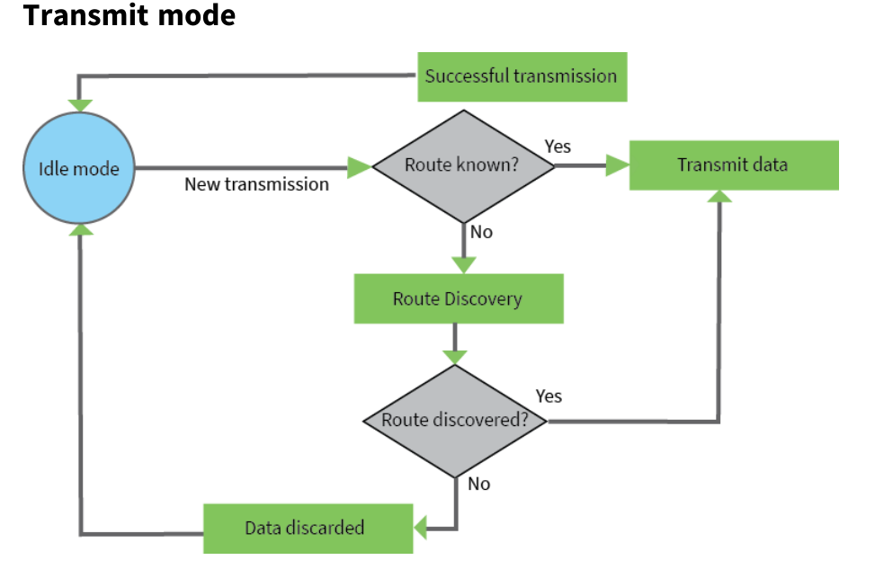

*Figura 4. Búsqueda de ruta, transmisión y retorno al reposo. Digi 90002173 Y, p. 50.*

Un fallo de respuesta remota puede producirse por alcance, ruta, congestión, incompatibilidad, suspensión o ausencia del equipo. El configurador no deduce una causa física concreta únicamente a partir de un timeout.

<a id="seccion-3-8"></a>

### 3.8 Suspensión de 900HP

| SM | Funcionamiento resumido | Consecuencia para el configurador |
|---:|---|---|
| 0 | Radio permanentemente despierto | Evita esperas ligadas al sueño |
| 1 | Suspensión asíncrona controlada por pin | El anfitrión debe poder despertarlo |
| 4 | Suspensión cíclica asíncrona | Una consulta puede coincidir con un período dormido |
| 5 | Suspensión cíclica asíncrona con control por pin | Combina temporización y señal de despertar |
| 7 | Soporte de una red con sueño síncrono, sin dormir el propio equipo | Participa en la sincronización de la red |
| 8 | Sueño cíclico síncrono | Las oportunidades de comunicación siguen el ciclo común |

El programa no consulta SM ni ajusta sus 10 s de espera remota al ciclo de sueño. Que un nodo no aparezca en dos intentos ND no demuestra su inexistencia. Los valores de esta tabla proceden de las páginas **54–56 de 900HP**, no de la tabla XSC incluida entre las capturas del Word.

<a id="seccion-3-9"></a>

### 3.9 Qué significa realmente CE

El manual describe `CE` como un campo de bits, con rango documentado 0–6:

| Máscara | Significado |
|---:|---|
| `0x01` | Habilita coordinador de mensajería indirecta |
| `0x02` | Deshabilita el enrutamiento del nodo |
| `0x04` | Habilita sondeo de mensajería indirecta |

Los bits `0x01` y `0x04` no pueden estar activos simultáneamente. El menú implementa solo `CE=0` y `CE=1`; el diccionario de presentación también conoce `CE=2`. [M, p. 84; C, L111–115 y L852–871]

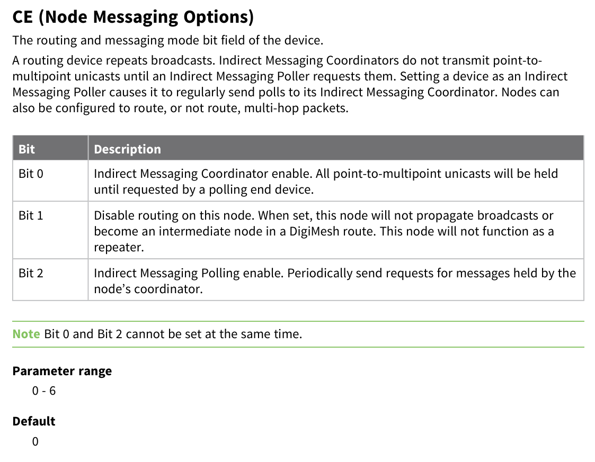

*Figura 5. CE, opciones de mensajería y enrutamiento. Digi 90002173 Y, p. 84.*

La recomendación del código «coordinador=1; router=0» es una elección del proyecto. **CE=1 no significa que DigiMesh necesite un coordinador central al estilo de una red Zigbee.** Su significado concreto es habilitar la mensajería indirecta: los unicasts punto a multipunto se retienen hasta que un dispositivo que sondea los solicita. Tampoco equivale automáticamente a ser coordinador de sueño, cuya elección depende de otros parámetros. [M, pp. 54–56, 68 y 84]

<a id="seccion-4"></a>

## 4 Parámetros AT y diferencias entre preparar aplicar y guardar

<a id="seccion-4-1"></a>

### 4.1 Un comando y dos formas de transportarlo

`ID` es el nombre de un parámetro. Puede transportarse como texto `ATID1234\r` en modo comando, o como dos letras ASCII `49 44` dentro de una trama API con un parámetro binario `12 34`. La orden semántica es la misma; cambia su envoltura.

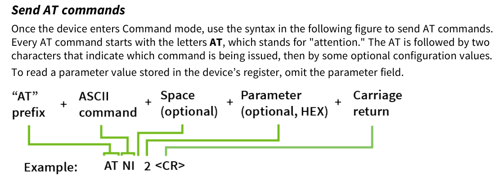

*Figura 6. Estructura AT, comando, parámetro y retorno de carro. Digi 90002173 Y, p. 51. Se usa la figura como descripción de sintaxis; los ejemplos numéricos de esta documentación se calculan independientemente.*

| Caso | Texto UART en modo comando | Campo AT y parámetro dentro de API |
|---|---|---|
| Leer ID | `ATID\r` | `49 44` |
| Establecer ID=0x1234 | `ATID1234\r` | `49 44 12 34` |
| Leer NI | `ATNI\r` | `4E 49` |
| Establecer NI=NODO1 | `ATNINODO1\r` | `4E 49 4E 4F 44 4F 31` |
| Guardar | `ATWR\r` | `57 52` |

En API no se añaden las letras `AT` ni `\r` alrededor del comando. El texto `"1234"` ocupa cuatro bytes ASCII; el número `0x1234` ocupa dos bytes binarios. Confundirlos cambia el valor enviado.

<a id="seccion-4-2"></a>

### 4.2 Diccionario de comandos utilizados

| Comando | Significado y representación | Uso efectivo en el programa | Sustento |
|---|---|---|---|
| `ID` | Identificador de red, 0–0x7FFF | Lectura, configuración local/remota y cambios temporales locales | M p. 80 |
| `AP` | Formato serial 0, 1 o 2 | Lectura, configuración y aislamiento temporal de sesiones AT | M pp. 94–95 |
| `CE` | Opciones de mensajería/enrutamiento | Lectura; el menú escribe 0 o 1 | M p. 84 |
| `NI` | Nombre ASCII imprimible, hasta 20 bytes | Lectura, configuración y sondeo de disponibilidad remoto | M pp. 87–88 |
| `SH` | Parte alta de MAC, 32 bits, solo lectura | Identificación local/remota | M p. 86 |
| `SL` | Parte baja de MAC, 32 bits, solo lectura | Identificación local/remota | M p. 86 |
| `VR` | Versión de firmware | Lectura informativa adicional | M p. 112 |
| `BD` | Baud rate o código de velocidad | Lectura informativa; no modifica la velocidad del radio | M pp. 92–93 |
| `HP` | Identificador de preámbulo | Lectura informativa; no se barre ni modifica | M p. 79 |
| `CM` | Máscara de canales | Lectura informativa; no se barre ni modifica | M pp. 78–79 |
| `DH` | Parte alta de dirección de destino | Lectura informativa | M p. 86 |
| `DL` | Parte baja de dirección de destino | Lectura informativa | M pp. 86–87 |
| `GT` | Guarda en milisegundos | Al inicio se solicita y, si procede, guarda 500 ms | M p. 112 |
| `NO` | Opciones de datos del descubrimiento | Solo lectura, determina cómo interpretar ND | M p. 88 |
| `NT` | Tiempo de descubrimiento en unidades de 100 ms | Solo lectura en el flujo del menú | M p. 88 |
| `N?` | Tiempo real máximo de descubrimiento en milisegundos | Consulta API local; ajusta la espera | M pp. 88 y 90 |
| `ND` | Descubrimiento de nodos | Orden API local y múltiples respuestas | M pp. 90–91 y 141 |
| `AC` | Aplica valores preparados | Aislamiento local y aplicación de cambios remotos | M pp. 77, 136–137 y 167 |
| `WR` | Guarda parámetros en memoria no volátil | GT, configuración definitiva y ciertas recuperaciones remotas | M p. 77 |
| `CN` | Sale de modo comando y aplica cambios pendientes | Salida de las sesiones AT locales | M p. 111 |

`COMANDOS_LECTURA_OBLIGATORIOS` contiene ID, AP, CE, NI, SH y SL. Si cualquiera falla, la lectura no se considera suficiente para configurar. Los adicionales VR, BD, HP, CM, DH y DL pueden quedar en `None`, con diferencias entre el tratamiento local y remoto explicadas más adelante.

<a id="seccion-4-3"></a>

### 4.3 Comandos relevantes que el código no ejecuta

| Comando | Por qué importa | Límite del archivo |
|---|---|---|
| `CC` | Define el carácter de entrada al modo comando | El código envía `+` y no adapta CC |
| `CT` | Limita cuánto permanece abierto el modo comando | No se modifica ni se consulta |
| `DB` | RSSI del último paquete RF recibido | No se consulta; RSSI proviene de ND si está incluido |
| `AO` | Selecciona `0x90` o `0x91` para datos recibidos | No se comprueba; ambas son ajenas a las respuestas AT buscadas |
| `SM` y parámetros de sueño | Determinan si un nodo está despierto | No se administran |
| `EE/KY` | Habilitación y clave de cifrado | No se leen ni se alteran; se presupone compatibilidad |
| `FR` | Reinicia el radio | No se usa para comprobar persistencia |
| `RE` | Carga valores de fábrica | No se utiliza como recuperación |
| `FN` | Busca vecinos de un salto | Se explica para contrastar formatos del manual, pero el código envía ND |
| `TO`, `RO`, `NP` | Entrega y empaquetamiento de datos | No forman parte de la configuración del menú |

<a id="seccion-4-4"></a>

### 4.4 Preparado aplicado y persistente

Un cambio puede estar preparado en los registros, activo en el comportamiento del equipo o guardado para sobrevivir a un reinicio. No son estados equivalentes.

| Acción | Efecto relevante | ¿Implica persistencia? |
|---|---|---|
| Escritura AT de texto | Cambia el valor del registro, sujeto a aplicación | No, sin WR |
| `AC` | Aplica cambios sin abandonar el modo comando | No |
| `CN` | Sale del modo comando y aplica lo pendiente | No |
| API local `0x08` | Aplica inmediatamente el parámetro escrito | No, salvo que el comando sea WR |
| API local `0x09` | Prepara un valor para aplicación posterior | No; no usado por este código |
| API remota `0x17`, opciones `0x00` | Prepara el parámetro sin activar el bit de aplicación | No |
| `WR` | Guarda parámetros en memoria no volátil | Sí, conforme al protocolo, si se confirma su ejecución |
| `AC` remoto posterior | Activa los cambios preparados | No añade por sí mismo persistencia |

La sección general del manual, p. 52, agrupa instrucciones de aplicación y guardado de forma poco clara. Para interpretar la secuencia remota se usan las secciones específicas: p. 137 explica expresamente guardar un cambio de ID en cola mediante WR y aplicarlo después, y p. 167 distingue aplicación mediante AC de guardado y reinicio. Por ello no se generaliza que «WR siempre cambia inmediatamente la red». El transporte y las opciones de la orden importan.

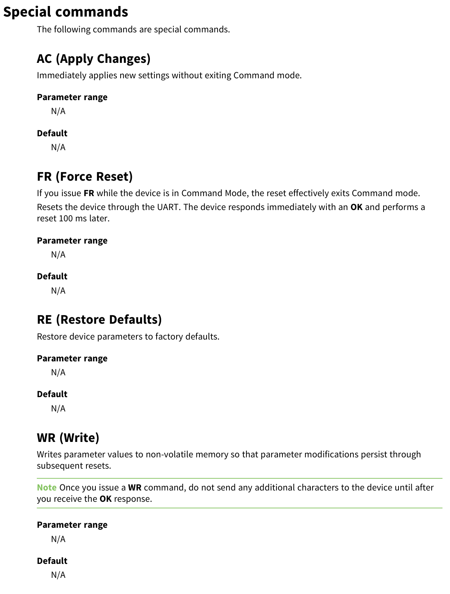

*Figura 7. Definiciones de AC y WR; la misma página también describe FR y RE, que el programa no ejecuta. Digi 90002173 Y, p. 77.*

Un extracto breve del manual resume la finalidad de WR: «Writes parameter values to non-volatile memory». En español, escribe los valores en memoria no volátil. Esto no convierte una lectura posterior sin reinicio en una prueba independiente de persistencia.

<a id="seccion-5"></a>

## 5 Requisitos arranque y organización general

<a id="seccion-5-1"></a>

### 5.1 Dependencias y versión de Python

Se utilizan módulos estándar: `argparse`, `json`, `signal`, `sys`, `time`, `contextlib`, `datetime`, `pathlib` y `zoneinfo`. La dependencia externa importada es **pySerial**, instalado como paquete `pyserial` e importado como módulo `serial`.

El archivo tal como se entregó necesita **Python 3.12 o posterior por su sintaxis**, debido a una f-string de `mostrarRegistro` que reutiliza comillas dobles dentro de la expresión:

```python
f"{"-"} {modulo.get('ni', '(sin NI)')} | "
```

Python 3.12 permite esta reutilización; Python 3.11 la rechaza durante el análisis del archivo. Aunque `zoneinfo` existe desde Python 3.9, eso no reduce el requisito de este archivo concreto. La documentación oficial de Python 3.12 confirma este cambio de sintaxis. [C, L1175–1182; referencia PY al final]

Además, `ZoneInfo("America/Bogota")` necesita que el entorno disponga de los datos de zona horaria. Una ausencia de esos datos fallaría al cargar el módulo, antes del menú.

Ejemplo de ejecución con la copia de fuente incluida:

```bash
python3 --version
python3 configurador_red_xbee_v6.5.py --puerto /dev/ttyUSB0 --baudios 9600
```

Si se conserva el nombre original con paréntesis, se encierra entre comillas. La instalación que indica la cabecera es `python3 -m pip install pyserial`; debe hacerse en el mismo intérprete o entorno que ejecutará el archivo. El programa no instala dependencias automáticamente.

`--baudios` cambia la velocidad usada por pySerial, **no envía ATBD**. El usuario debe conocer la velocidad actualmente configurada en el radio. La opción 6 cambia de puerto conservando esa velocidad; no ofrece un segundo selector de baudios.

<a id="seccion-5-2"></a>

### 5.2 Constantes de tiempos y límites

| Constante | Valor | Interpretación |
|---|---:|---|
| `BAUDIOS` | 9600 | Valor por defecto del puerto UART |
| `TIEMPO_ESPERA_SERIAL_S` | 0,100 s | Espera de cada lectura serial sin datos |
| `TIEMPO_RESPUESTA_AT_S` | 1,0 s | Presupuesto de espera de respuesta AT de texto |
| `TIEMPO_RESPUESTA_API_S` | 2,0 s | Espera predeterminada de comando API local |
| `TIEMPO_RESPUESTA_REMOTA_S` | 10,0 s | Espera por intento de comando remoto |
| `TIEMPO_GUARDA_INICIAL_S` | 1,100 s | Guarda usada antes de conocer/preparar GT |
| `GT_CONFIGURADOR_MS` | 500 ms | GT que se solicita al iniciar |
| `TIEMPO_GUARDA_S` | 0,550 s | Guarda normal con margen sobre 500 ms |
| `TIEMPO_ENTRE_BYTES_API_S` | 0,500 s | Recuperación de datos de trama abandonados |
| `INTENTOS_DESCUBRIMIENTO` | 2 | Segundo ND si no se encontró remoto |
| `TIEMPO_MAXIMO_DESCUBRIMIENTO_S` | 60 s | Tope del cálculo de respaldo de ND; no es un tope universal |
| `MAX_LONGITUD_API` | 2048 bytes | Límite del lector de este configurador, no del protocolo de 16 bits |
| `ID_MAXIMO_900HP` | 0x7FFF | Último ID admitido |

El timeout de `puerto.read()` y el plazo global de una operación son diferentes. El primero deja recuperar el control periódicamente; el segundo determina durante cuánto tiempo se siguen intentando lecturas. La precisión de un plazo es aproximada, pues una lectura iniciada antes del límite puede acabar hasta un timeout serial después.

<a id="seccion-5-3"></a>

### 5.3 Dónde se guarda el registro

```python
RUTA_REGISTRO = Path(__file__).resolve().with_name(
    "xbee_configurados.json"
)
```

`__file__` identifica el archivo Python. `resolve()` obtiene su ruta resuelta y `with_name()` conserva el directorio, cambiando el nombre final. Por ello el JSON se guarda junto al programa, aunque la terminal haya iniciado el comando desde otro directorio. La carpeta del script debe permitir escritura.

<a id="seccion-5-4"></a>

### 5.4 Secuencia de main

`main` crea el analizador de argumentos, lee puerto y baudios, obtiene la selección del puerto y llama a `configurarGtAlIniciar`. Si esta preparación falla con los errores controlados, termina con «Error al configurar GT» en lugar de abrir un menú que presuponga GT válido. [C, L2551–2646]

Después mantiene el menú en un `while True`. Las opciones 1 y 2 actualizan el NI y el ID mostrados en el encabezado. Las opciones 3 y 5 devuelven NI; se espera que el ID vuelva al original por el contexto de recuperación. La opción 6 pone primero el ID visible en `None`, prepara el nuevo puerto y actualiza la información.

| Opción | Función llamada | Estado externo que puede cambiar |
|---:|---|---|
| 1 | `operacionLeer` | AP temporal durante la sesión y datos visibles del menú |
| 2 | `operacionConfigurar` | ID/AP/CE/NI persistentes y JSON si la comparación termina bien |
| 3 | `operacionDescubrir` | ID/AP temporales, JSON de hallazgos y posibles pendientes confirmados |
| 4 | `mostrarRegistro` | Solo lectura del JSON |
| 5 | `operacionConfigurarRemoto` | Configuración del remoto, ID local temporal y JSON |
| 6 | `seleccionarPuerto` y `configurarGtAlIniciar` | Puerto usado y, si es necesario, GT persistente del módulo elegido |
| 0 | Salida del bucle | Termina el proceso por el camino normal |

Antes de las opciones 3 y 5 se muestra el registro. Si su JSON está dañado, esa lectura puede impedir llegar a la operación de radio hasta resolver el problema del archivo.

El `try` del menú controla `KeyboardInterrupt` durante una operación y varios errores de comunicación. La entrada que pide la opción principal está fuera de ese `try`; un Ctrl+C allí no sigue necesariamente la misma ruta de cancelación que uno durante una búsqueda. Esta distinción se conserva al documentar el alcance real de la recuperación.

<a id="seccion-6"></a>

## 6 Funciones básicas y selección del puerto

<a id="seccion-6-1"></a>

### 6.1 Errores controlados

`ErrorXBee` es una excepción propia sin lógica adicional: diferencia un problema previsto del configurador de otros errores de programación. `ErrorComandoApi` deriva de ella y añade `estado`. Este atributo es esencial para no tratar igual un rechazo explícito del radio y una respuesta ausente. [C, L146–155]

| Estado API | Interpretación del programa | Ejemplo de consecuencia |
|---:|---|---|
| 0 | Éxito de la orden | Se procesa el dato o se devuelve `"OK"` |
| 1 | ERROR | No se reintenta como si fuera una pérdida de radio |
| 2 | Comando no válido | Un registro adicional puede marcarse como no disponible |
| 3 | Parámetro no válido | Rechazo de la solicitud |
| 4 | Fallo de transmisión | Algunas consultas remotas pueden reintentarse |
| 12, `0x0C` | Error de cifrado | Se informa el error; no se interpreta como éxito |
| `None` | No llegó la respuesta esperada | El resultado de una escritura puede ser incierto |

Los estados 4 y 12 pertenecen a la respuesta remota documentada en p. 163; la tabla de `0x88` local enumera 0–3. El código usa un diccionario común para presentarlos.

<a id="seccion-6-2"></a>

### 6.2 Funciones auxiliares pequeñas

`fechaHoraActual()` devuelve texto ISO 8601 con segundos y el desplazamiento horario de Bogotá. Sirve para fechar registros, no para medir tiempos de espera. Para estos últimos el programa usa `time.monotonic()`, que evita depender de ajustes de la hora del sistema. [C, L160–162]

`bytesAEntero(datos)` devuelve cero si la secuencia está vacía y, en caso contrario, aplica `int.from_bytes(datos, "big")`. Se usa en la lectura de las mitades de MAC de ND. Esa conversión genérica no comprueba la longitud; `analizarRespuestaNd` realiza sus propias verificaciones. [C, L165–170]

`descripcionModo(modo)` convierte las constantes internas en descripciones. Distingue modo comando de AP=0. En el archivo actual, las líneas de presentación que la utilizaban están comentadas; la función sigue definida pero no interviene en el flujo activo del menú. [C, L173–181 y L772–773]

`pedirConfirmacion(mensaje)` repite una pregunta hasta recibir una de las variantes de sí o no admitidas. Usa `strip().lower()` y devuelve un booleano. Pulsar Enter vacío no confirma. Las confirmaciones previas a escritura utilizan este resultado. [C, L184–195]

<a id="seccion-6-3"></a>

### 6.3 listarPuertosSeriales

Solicita `list_ports.comports()` y ordena los objetos por su atributo `.device`. Devuelve objetos completos, no una lista de nombres. `.device` puede ser `/dev/ttyUSB0`; `.description` aporta una descripción del adaptador. El orden es lexicográfico, no una garantía de identificación física permanente. [C, L200–201]

<a id="seccion-6-4"></a>

### 6.4 seleccionarPuerto

Si llega `puertoPreferido`, se intenta leer el NI de esa ruta y se devuelve directamente `(ruta, ni)`. No se exige que el NI se haya podido leer antes de devolverla; la preparación posterior de GT comprueba la comunicación con más consecuencias.

Sin ruta preferida, enumera los puertos y prueba `identificarNiEnPuerto` en cada uno. Muestra la ruta, descripción y NI cuando existe. Permite escoger un puerto por número o introducir otra ruta; si no se detectaron puertos, también permite la ruta manual. Enter en la ruta manual usa `/dev/ttyUSB0`. [C, L249–341]

**La identificación no es una simple lectura del sistema operativo.** Intenta abrir cada puerto y enviar secuencias AT para consultar NI. Puede demorarse varios segundos por puerto y debe utilizarse sobre los adaptadores del montaje. No verifica que cada puerto enumerado sea un XBee antes de intentar esa comunicación.

<a id="seccion-6-5"></a>

### 6.5 abrirPuerto

Construye `serial.Serial` con la ruta elegida, baudios, 8N1, timeout de lectura de 0,1 s y timeout de escritura de 2 s. Convierte un `serial.SerialException` de apertura en `ErrorXBee` con la ruta afectada. [C, L344–362]

El patrón usado por las operaciones es:

```python
with abrirPuerto(rutaPuerto, baudios) as puerto:
    configuracion = leerConfiguracionLocal(puerto)
```

`puerto` es el objeto que permite `read`, `write`, `flush` y cierre; no es la cadena `/dev/ttyUSB0`. Al salir del bloque `with`, pySerial cierra el puerto incluso si una instrucción falla. Cerrar el puerto **no equivale a reiniciar el XBee** ni a restaurar sus parámetros. Esa restauración la realizan otras funciones antes del cierre.

<a id="seccion-7"></a>

## 7 Comunicación local AT de texto

<a id="seccion-7-1"></a>

### 7.1 leerRespuestaTexto

Esta función reconstruye **una línea** de respuesta. Calcula un plazo con `time.monotonic()`, lee un byte cada vez y acumula el contenido en un `bytearray`. [C, L367–405]

Su lógica distingue tres situaciones:

1. Un `read(1)` devuelve `b""`: aún no hay byte, se continúa mientras quede plazo.
2. Llega `\r`: se da por terminada la línea, incluso si está vacía.
3. Llega `\n`: se termina si ya había contenido; un salto inicial se ignora.

Al completar la línea, decodifica ASCII con sustitución de bytes no válidos y aplica `strip()`. Si vence el tiempo sin terminador, devuelve `None`; no devuelve una línea parcial como si estuviera completa.

La diferencia entre `""` y `None` es importante. `""` puede ser una respuesta textual vacía válida de NI; `None` indica que no se recibió una línea completa. Para una consulta numérica, una cadena vacía será rechazada por `enviarComandoTexto`.

`strip()` elimina espacios al principio y al final. El programa no conserva literalmente un NI cuyos espacios extremos formen parte del nombre. Además, esta función no tiene un búfer persistente propio entre llamadas: si una línea queda incompleta al vencer el plazo, los bytes ya consumidos no se devuelven a la siguiente llamada. Esto contrasta con el lector API.

<a id="seccion-7-2"></a>

### 7.2 entrarModoComando

El recorrido es:

1. Descarta el estado de reconstrucción API guardado en el objeto serial.
2. Vacía los búferes de entrada y salida de pySerial.
3. Espera la guarda anterior a `+++`.
4. Escribe exactamente `b"+++"` y hace `flush()`.
5. Espera la guarda posterior.
6. Busca una respuesta `OK` dentro del plazo.
7. Si no la reconoce, lanza `ErrorXBee` con aspectos que revisar.

La guarda inicial de 1,1 s pretende cubrir GT de fábrica de 1000 ms. Después de preparar GT=500 ms, las entradas normales usan 0,55 s. No hay exploración de todos los GT posibles ni lectura de CC antes de entrar: si CC ya no es `+` o GT supera la guarda utilizada, puede fallar. El manual permite GT hasta `0x95C` ms. [C, L407–443; M, pp. 51 y 112]

`flush()` espera a que se escriban los datos del puerto; no significa que el XBee haya ejecutado el comando. Para eso se necesita su respuesta. `reset_input_buffer()` descarta datos recibidos pendientes; tampoco impide que lleguen bytes nuevos por radio. [Referencia SERIAL]

La función tolera líneas ajenas antes de OK y también una línea que termine en `OK`, por si una trama previa se pegó a la respuesta. Es una decisión de robustez ante la contaminación observada, pero **es una heurística**: una línea ajena terminada en esas letras también podría aceptarse. No hay checksum ni identificador de transacción en esta comunicación textual.

<a id="seccion-7-3"></a>

### 7.3 enviarComandoTexto

Recibe `puerto`, un comando de dos letras en los usos del programa y un parámetro opcional. Construye `AT` más el nombre; si es NI incorpora texto y, para los demás parámetros, los representa como hexadecimal en mayúsculas mediante `f"{parametro:X}"`. Añade `\r`, codifica en ASCII y transmite. [C, L446–547]

Ejemplo: `enviarComandoTexto(puerto, "ID", 26)` transmite `ATID1A\r`. El argumento correcto aquí es el entero 26 o `0x1A`; la cadena `"1A"` no es compatible con el formato `:X`. Un comentario del archivo utiliza esa cadena como ejemplo, pero no representa una llamada ejecutable correcta a la implementación.

Después de enviar, exige las siguientes respuestas:

| Tipo de operación | Respuesta aceptada | Retorno Python |
|---|---|---|
| Escritura de parámetro | `OK` | `"OK"` |
| Control AC, WR o CN | `OK` | `"OK"` |
| Consulta NI | Texto o cadena vacía | `str` |
| Otra consulta empleada | Texto hexadecimal válido | `int` |

En escrituras y controles, sigue leyendo líneas ajenas dentro del plazo y reconoce también los sufijos `OK` y `ERROR`. Un `ERROR`, ausencia de respuesta o formato numérico inválido se transforma en una excepción.

En consultas numéricas, no sigue buscando indefinidamente una línea que «parezca mejor»: analiza la recibida y rechaza lo que no sea hexadecimal. Esto hace especialmente relevante el aislamiento temporal que se realiza antes de las lecturas.

<a id="seccion-7-4"></a>

### 7.4 entrarModoComandoAislado

Su objetivo es reducir la mezcla de datos de sensores con respuestas AT. No apaga la radio ni ordena que los remotos dejen de transmitir. Emplea AP=0 temporalmente dentro de una sesión de modo comando. [C, L550–599]

La secuencia detallada es:

1. Entra en modo comando por `+++`.
2. Consulta AP hasta cuatro veces.
3. Exige dos lecturas consecutivas iguales y pertenecientes a `{0,1,2}`.
4. Conserva ese AP en la variable `apOriginal` y en `puerto._apRestaurarXbee`.
5. Si era distinto de cero, escribe `ATAP0`, envía `ATAC` y comprueba que AP devuelve cero.
6. Vacía el búfer de entrada y devuelve el AP original.

La doble lectura evita aceptar una sola línea casual de sensor como si fuera el AP real. Guardar el valor en el objeto antes de la primera escritura permite intentar recuperarlo incluso si se pierde el OK de `ATAP0` o `ATAC`.

El manual indica que, en transparente y modo comando, se detiene el envío de datos para aceptar órdenes locales [M, p. 51]. **El uso concreto de AP=0 más AC como aislamiento es una decisión de esta implementación.** No se convierte aquí en una promesa de ausencia absoluta de datos residuales, de silencio RF o de conservación de telemetría. El comportamiento con el firmware y tráfico reales debe verificarse en el montaje.

La función captura `BaseException`, por lo que incluye `KeyboardInterrupt`. Si había confirmado la entrada, intenta salir y recuperar AP. Si también falla esa recuperación, comunica ambos problemas. Si nunca logró conocer AP, solo dispone de información limitada para restaurar; no puede reconstruir un valor inicial que no llegó a leer de manera fiable.

<a id="seccion-7-5"></a>

### 7.5 salirModoComando

Recupera el AP indicado por el llamador o, si no se proporciona, el guardado en `puerto._apRestaurarXbee`. Realiza hasta tres intentos bajo protección contra un segundo Ctrl+C. [C, L602–645]

En cada intento:

1. Si ya hubo un fallo previo, intenta volver a entrar por `+++` con 1,1 s de guarda.
2. Si esa entrada falla, envía `\r` para limpiar una posible línea de comando incompleta.
3. Obtiene o comprueba que AP sea 0, 1 o 2.
4. Escribe el AP que debe quedar y lo consulta otra vez.
5. Envía `ATCN` y exige OK.
6. Si AP es 1 o 2, realiza una consulta API `0x08` de AP y comprueba el resultado.
7. Limpia `_apRestaurarXbee` y termina.

La consulta API final confirma que el radio volvió a responder con la envoltura binaria esperada. Por eso la descripción abreviada «la opción local usa solo texto» necesita una precisión: **la lectura y escritura de parámetros del menú son AT de texto, pero la salida a AP=1/2 incluye una comprobación API**.

Cuando AP es cero no hay una comprobación API equivalente: la evidencia de salida consiste en haber leído AP y recibido OK de CN. No se envía WR durante esta restauración.

Si fracasan los tres intentos, lanza un error que dice expresamente que no se pudo confirmar la restauración. Cerrar el programa después no transforma ese estado incierto en una recuperación demostrada.

<a id="seccion-7-6"></a>

### 7.6 configurarGtAlIniciar

Abre el puerto, entra con aislamiento y guarda inicial de 1,1 s, consulta GT e ID y, si GT no vale 500, escribe el valor `500`, que se serializa como hexadecimal `1F4`. Restablece el AP original **antes de WR**, para no guardar accidentalmente el AP=0 temporal. Ejecuta WR únicamente si GT era diferente de 500. Finalmente sale del modo comando y devuelve el ID leído. [C, L648–682]

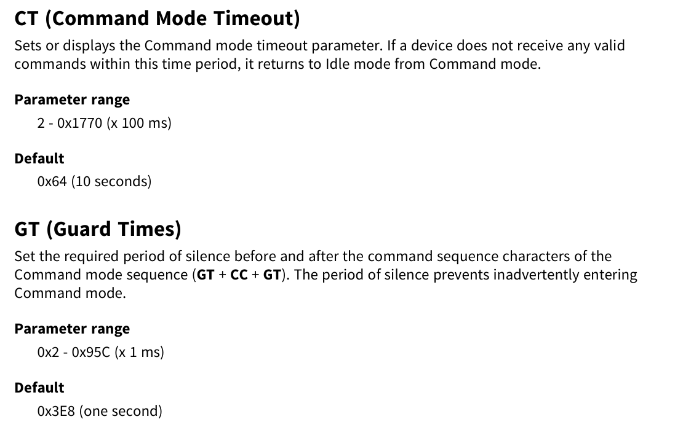

*Figura 8. CT usa unidades de 100 ms; GT usa milisegundos. Digi 90002173 Y, p. 112.*

Este procedimiento evita escribir flash en cada inicio cuando GT ya es 500. Sin embargo, tiene tres límites concretos:

- No hace una lectura final de GT para compararlo ni reinicia el radio después de WR.
- WR guarda el conjunto de parámetros pertinente del radio, no exclusivamente GT. Si existían otros cambios pendientes ajenos a esta operación, el programa no los inventaría ni los distinguiría como una transacción separada.
- Una vez modificado, GT queda como decisión persistente del configurador; no se devuelve al valor previo al salir.

`configuracionTerminada` aparece en esta función, pero ambas ramas del `finally` llaman exactamente a `salirModoComando(puerto, apOriginal)`. En este punto la variable no produce dos recuperaciones diferentes.

<a id="seccion-8"></a>

## 8 Lectura local y captura de nuevos valores

<a id="seccion-8-1"></a>

### 8.1 identificarNiEnPuerto

Abre la ruta, entra en aislamiento con la guarda inicial, consulta NI, sale restaurando AP y devuelve el nombre o `None`. Si falla con uno de los errores previstos, devuelve `None` para permitir mostrar «NI no disponible». [C, L687–706]

Ese resultado no distingue entre nombre vacío, dispositivo ajeno, baud rate incorrecto, puerto ocupado o error de recuperación. Es una identificación preliminar, no un diagnóstico completo. Aunque su docstring dice «sin modificar la configuración», sí puede modificar AP temporalmente; no pretende guardar un cambio persistente.

<a id="seccion-8-2"></a>

### 8.2 leerRegistrosConfiguracion

Supone que el llamador ya abrió modo comando. Lee primero los seis registros obligatorios; después los seis adicionales. Un `ErrorXBee` de un adicional hace que se guarde `None` y se continúe. [C, L709–738]

Construye la MAC concatenando SH y SL con ocho cifras hexadecimales cada uno:

```python
configuracion["MAC"] = (
    f"{configuracion['SH']:08X}{configuracion['SL']:08X}"
)
```

Por ejemplo, `SH=0x0013A200` y `SL=0x40B9B5D2` producen `0013A20040B9B5D2`. El relleno conserva los ceros iniciales; no se suman ni se concatenan las representaciones decimales. SH/SL identifican al módulo y no cambian cuando se edita NI o Linux renumera el USB. [M, p. 86]

Una limitación de la lectura local es que un timeout de un registro adicional también puede convertirse en `None`, igual que un comando no admitido. La lectura remota es más selectiva: no oculta una pérdida de enlace como si fuera simplemente una función ausente.

<a id="seccion-8-3"></a>

### 8.3 leerConfiguracionLocal y mostrarConfiguracion

`leerConfiguracionLocal` entra con aislamiento, llama al lector de registros y reemplaza `configuracion["AP"]` con el valor inicial. Sin ese reemplazo, mostraría AP=0, que solo pertenece a la sesión temporal. Un `finally` obliga a pasar por la salida y recuperación aunque falle una consulta. [C, L741–754]

`mostrarConfiguracion` solo imprime el diccionario: MAC, NI, ID, AP, CE, BD si está disponible, VR, HP, CM y DH/DL. No lee el equipo. La ausencia de un dato adicional hace que no se muestre. Para un BD conocido, el diccionario `BAUDIOS_POR_BD` traduce el código a baudios; otros valores se presentan en hexadecimal. [C, L757–798]

Las etiquetas de CE provienen de un diccionario parcial. Un valor permitido por el fabricante pero no incluido puede aparecer como «valor desconocido». Eso no demuestra que el firmware esté dañado.

<a id="seccion-8-4"></a>

### 8.4 pedirId

Acepta Enter para conservar el valor actual o convierte la entrada mediante `int(respuesta,16)`. Python acepta el prefijo `0x`; el bloque comentado para retirarlo no se ejecuta ni hace falta para las formas normales admitidas. Rechaza números fuera de `0x0000–0x7FFF`. [C, L803–827]

Escribir `10` significa hexadecimal 0x10, es decir, decimal 16. La documentación del barrido también usa extremos hexadecimales; esta convención debe mantenerse al registrar ensayos.

<a id="seccion-8-5"></a>

### 8.5 pedirAp y pedirCe

`pedirAp` solo acepta 0, 1 y 2 o Enter. Explica las alternativas y devuelve un entero. Su recomendación local=1/remoto=0 no es una regla impuesta por el protocolo. [C, L830–849]

`pedirCe` ofrece únicamente 0 y 1. **Si el valor leído era otro, el valor propuesto por defecto pasa a cero.** En esa situación, Enter no conserva el CE original, aunque el texto general del formulario diga que Enter conserva el valor entre corchetes. Conserva el propuesto, que ya es cero. Esto importa si se conecta un equipo configurado como no enrutador o con otras opciones de mensajería. [C, L852–871]

<a id="seccion-8-6"></a>

### 8.6 pedirNi

La función quita espacios extremos, conserva el NI actual si se introduce una entrada vacía, exige al menos un byte y un máximo de 20, comprueba ASCII y rechaza comas, retornos, saltos y caracteres no imprimibles. [C, L874–906]

El manual permite entre 0 y 20 bytes imprimibles y define coma o retorno como terminadores del comando. El configurador aplica una política más estricta: no permite dejar un NI vacío. Esta es una restricción del programa, no del hardware. Una coma podría encadenar otra orden en modo comando; rechazarla evita que un nombre altere la sintaxis AT. [M, pp. 51 y 87–88]

<a id="seccion-8-7"></a>

### 8.7 pedirNuevaConfiguracion

Recorre las parejas ID/pedirId, AP/pedirAp, CE/pedirCe y NI/pedirNi. Antes de cada pregunta limpia la pantalla si es una terminal, muestra el encabezado local y la configuración del equipo sobre el que se trabaja. Reúne los resultados en `nueva` y presenta un resumen final. **No escribe parámetros.** La confirmación y escritura ocurren después. [C, L909–937]

En una operación remota, `configuracionActual` corresponde al remoto y `configuracionLocal` al XBee de la Raspberry. Esta separación permite mostrar el puerto local sin confundirlo con el destino de la modificación. El encabezado puede mostrar el ID local inicial mientras la visita de radio usa otro ID temporal; no es una consulta en vivo de ese ID temporal.

<a id="seccion-9"></a>

## 9 Configuración local completa

<a id="seccion-9-1"></a>

### 9.1 operacionLeer

La opción 1 abre el puerto mediante `with`, llama a `leerConfiguracionLocal`, lo cierra, muestra los valores y devuelve `(NI o None, ID)` para actualizar el encabezado. **No guarda esa lectura en el JSON.** [C, L2351–2368]

<a id="seccion-9-2"></a>

### 9.2 operacionConfigurar

La opción 2 usa tres aperturas separadas del puerto:

1. **Lectura:** obtiene el estado inicial y cierra el puerto.
2. **Interacción:** solicita los cuatro valores y pide confirmación con el puerto cerrado.
3. **Escritura:** abre de nuevo y llama a `configurarEnModoComando`.
4. **Espera:** deja 0,5 s tras cerrar la fase de escritura.
5. **Verificación:** vuelve a abrir y lee la configuración.
6. **Comparación:** contrasta ID/AP/CE/NI con lo solicitado.
7. **Registro:** solo si coinciden, guarda el módulo y anuncia éxito.

Separar el tiempo de decisión humana de la sesión AT evita que CT expire mientras el usuario piensa un nombre o compara opciones. No prueba que el equipo se haya reiniciado entre aperturas. [C, L2371–2424]

<a id="seccion-9-3"></a>

### 9.3 configurarEnModoComando

Entra en aislamiento, escribe ID, CE y NI, y deja AP para el final. De esa manera mantiene AP=0 durante la mayor parte del diálogo. Luego envía WR, exige OK, marca la preparación como terminada y espera 0,25 s. [C, L942–975]

El `finally` elige el AP que debe restaurar:

- Si WR fue confirmado, la salida usa el AP nuevo solicitado por el usuario.
- Si la fase no terminó, intenta recuperar el AP original.

**Esta recuperación no revierte automáticamente ID, CE y NI.** Una escritura parcial puede permanecer en los registros y CN puede aplicar cambios pendientes. Si WR llegó a ejecutarse pero se perdió su OK, el estado de flash también puede ser incierto. La implementación no mantiene un registro pendiente para la configuración local equivalente al remoto.

Esta distinción evita una interpretación peligrosa de Ctrl+C: cancelar antes de aceptar el resumen no inicia las cuatro escrituras; cancelar después de comenzar la comunicación no garantiza «ningún cambio».

<a id="seccion-9-4"></a>

### 9.4 comprobarConfiguracion

Recorre ID, AP, CE y NI. Por cada desigualdad genera un mensaje con lo esperado y lo leído. Usa `!r` para que cadenas y caracteres especiales se representen con claridad. Una lista vacía significa coincidencia de los cuatro registros. [C, L978–989]

No compara GT, SH/SL, firmware, DH/DL, HP o CM. Tampoco vuelve a consultar hardware: recibe dos diccionarios y compara sus valores.

<a id="seccion-9-5"></a>

### 9.5 Qué demuestra el éxito local

Demuestra que se recibió confirmación de WR y que una lectura posterior de los cuatro registros coincidió con lo solicitado, además de las verificaciones de salida del modo comando. Conforme al manual, WR es la operación que guarda en memoria no volátil.

**No demuestra por ensayo automático que el módulo conserve esos valores después de apagarlo.** El código no envía FR ni controla alimentación. Para demostrar ese requisito se necesita un ensayo adicional: registrar los cuatro valores, reiniciar el radio y repetir la lectura. No es necesario modificar el programa para describir honestamente esta diferencia.

<a id="seccion-10"></a>

## 10 Estructura binaria de las tramas API

<a id="seccion-10-1"></a>

### 10.1 La envoltura común

Una trama API lógica contiene:

| Campo | Tamaño | Ejemplo ND | Observación |
|---|---:|---|---|
| Delimitador | 1 byte | `7E` | No se incluye en longitud ni checksum |
| Longitud | 2 bytes | `00 04` | Cuenta únicamente los datos de trama sin escapes |
| Datos de trama | Variable | `08 01 4E 44` | Tipo, identificador y campos de la orden |
| Checksum | 1 byte | `64` | Complementa la suma de datos a 0xFF módulo 256 |

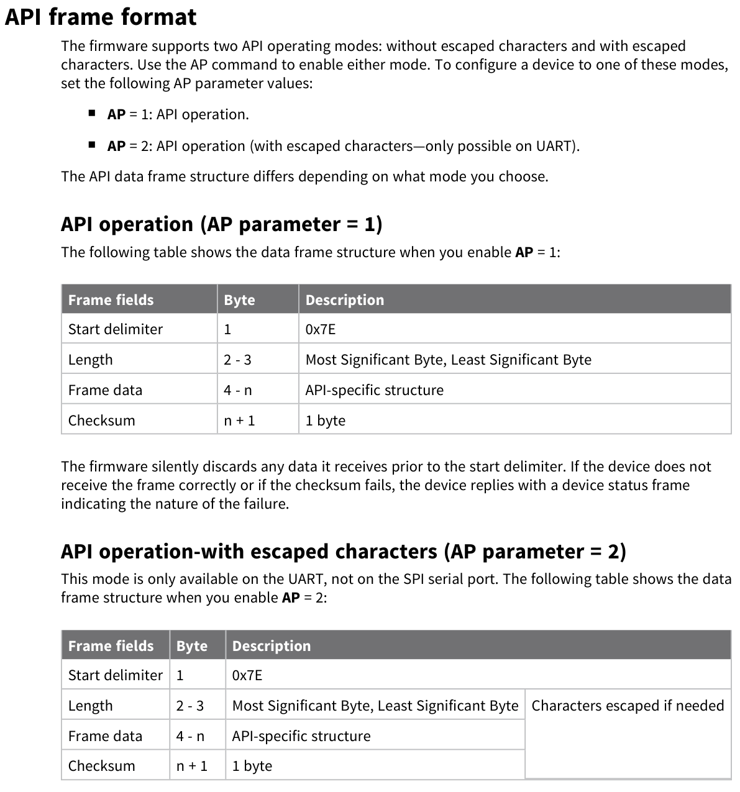

*Figura 9. Tablas de API sin escapes y con escapes. Digi 90002173 Y, p. 116.*

`datosTrama` no es la trama completa. Cuando `leerTramaApi` devuelve bytes, ya retiró delimitador, longitud y checksum. Por eso los índices de Python del contenido comienzan tres posiciones antes que los offsets de la trama completa mostrados por el fabricante.

<a id="seccion-10-2"></a>

### 10.2 Ejemplo ND completo

Con identificador de trama 1, el código forma:

```text
7E 00 04 08 01 4E 44 64
```

`08` solicita un AT local; `01` identifica esta solicitud; `4E 44` son las letras N y D. La suma de datos es `0x08+0x01+0x4E+0x44=0x9B`. El complemento es `0xFF−0x9B=0x64`. La longitud es cuatro porque solo cuenta esos cuatro bytes de datos.

El ND es **un comando local que provoca actividad de descubrimiento por radio**. No necesita ser una trama remota `0x17` para que busque otros nodos.

<a id="seccion-10-3"></a>

### 10.3 Checksum y operaciones bit a bit

El código calcula:

```python
checksum = bytes([(0xFF - sum(datosTrama)) & 0xFF])
```

La condición general de validación es:

```python
((sum(datosTrama) + checksum_recibido) & 0xFF) == 0xFF
```

El `& 0xFF` conserva los ocho bits inferiores. No exige que la suma aritmética completa sea exactamente 255: puede ser 511, 767 u otro entero cuyo byte inferior sea `FF`. Algunos comentarios del archivo explican el caso sencillo de una suma menor de 256; la expresión ejecutada sí utiliza correctamente el módulo de 256. [M, pp. 120–121]

La longitud se convierte mediante `len(datosTrama).to_bytes(2,"big")`. Al leer, `(alto << 8) | bajo` reconstruye el entero. Para `01 02`, el resultado es `0x0102=258`.

<a id="seccion-10-4"></a>

### 10.4 API 2 y caracteres escapados

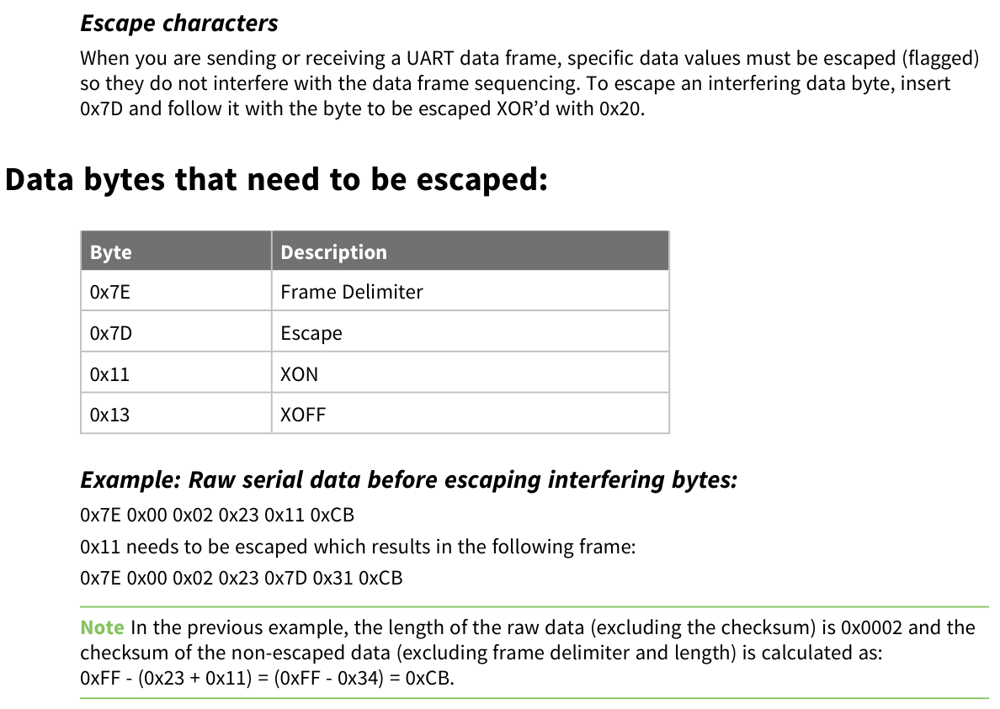

*Figura 10. Regla de escape y ejemplo original de Digi 90002173 Y, p. 117.*

| Byte original | Representación UART en API 2 | Cálculo |
|---|---|---|
| `7E` | `7D 5E` | `7E XOR 20 = 5E` |
| `7D` | `7D 5D` | `7D XOR 20 = 5D` |
| `11` | `7D 31` | `11 XOR 20 = 31` |
| `13` | `7D 33` | `13 XOR 20 = 33` |

`escaparDatosApi` recorre todos los bytes y sustituye los cuatro reservados. `crearTramaApi` lo aplica a longitud, datos y checksum **después** de calcular longitud y checksum originales; añade por fuera el primer `7E`, que nunca se escapa. [C, L1307–1396]

Ejemplo calculado para consultar AP con identificador `0x11`:

```text
API 1: 7E 00 04 08 11 41 50 55
API 2: 7E 00 04 08 7D 31 41 50 55
```

La trama API 2 ocupa un byte UART más, pero su campo de longitud sigue en cuatro. El receptor deshace `7D 31` a `11` antes de evaluar el contenido y el checksum.

<a id="seccion-10-5"></a>

### 10.5 Tres identificadores distintos

| Identificador | Ejemplo | Qué identifica |
|---|---|---|
| `ID` de red | `0x0009` | Grupo de comunicación RF |
| MAC de 64 bits | `0013A20040B9B5D2` | Equipo físico destinatario o emisor |
| Frame ID | `0x11` | Solicitud API concreta para asociarla con su respuesta |

`siguienteIdTrama` mantiene un atributo de función, suma uno y vuelve a 1 después de 255. Nunca devuelve cero, porque cero suprime la respuesta en los tipos empleados. El contador vive en memoria del proceso, no en el JSON. [C, L1540–1551; M, p. 118]

<a id="seccion-10-6"></a>

### 10.6 Tipos usados y tipos que se filtran

| Tipo | Dirección respecto de Python y XBee local | Contenido | Tratamiento del configurador |
|---|---|---|---|
| `0x08` | Python → XBee local | Comando AT local | Genera consultas, ND y cambios locales temporales |
| `0x88` | XBee local → Python | Respuesta AT local | Comprueba identificador, comando y estado |
| `0x17` | Python → XBee local | Solicitud AT dirigida a MAC remota | Genera configuración y consultas remotas |
| `0x97` | XBee local → Python | Respuesta AT de un remoto | Comprueba además la MAC emisora |
| `0x90` | XBee local → Python | Datos RF y dirección del emisor | Reconstruye la trama y la descarta en espera de AT |
| `0x91` | XBee local → Python | Datos RF con direccionamiento explícito | Ajena al diálogo AT de este programa |
| `0x95` | XBee local → Python | Aviso de identificación de nodo | No equivale a respuesta ND y no se registra por ese camino |
| `0x09` | Python → XBee local | AT local en cola | No se genera |
| `0x10/0x11` | Python → XBee local | Solicitudes de transmisión de datos | No se generan |
| `0x8A/0x8B` | XBee local → Python | Estado de módem o de transmisión | No se usan para resolver las órdenes AT del menú |

El primer byte del contenido basta para clasificar el tipo, pero no para decidir que la respuesta es la esperada. Dos comandos distintos pueden producir `0x88`; por eso se verifican también Frame ID y letras del comando.

<a id="seccion-11"></a>

## 11 Comandos locales remotos y datos de sensores por API

<a id="seccion-11-1"></a>

### 11.1 Solicitud local 0x08 y respuesta 0x88

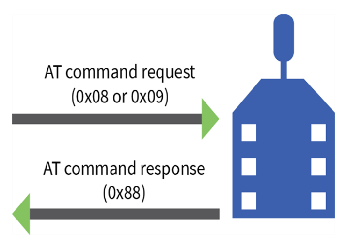

*Figura 11. Un AT local produce una respuesta local. Digi 90002173 Y, p. 119.*

El radio conectado al puerto ejecuta la orden. `0x08` no contiene dirección de destino porque el destinatario es ese mismo radio. Según el manual, las escrituras de parámetros mediante este tipo se aplican inmediatamente; no se necesita abandonar y reabrir modo comando para cada cambio temporal de ID. [M, pp. 124–125]

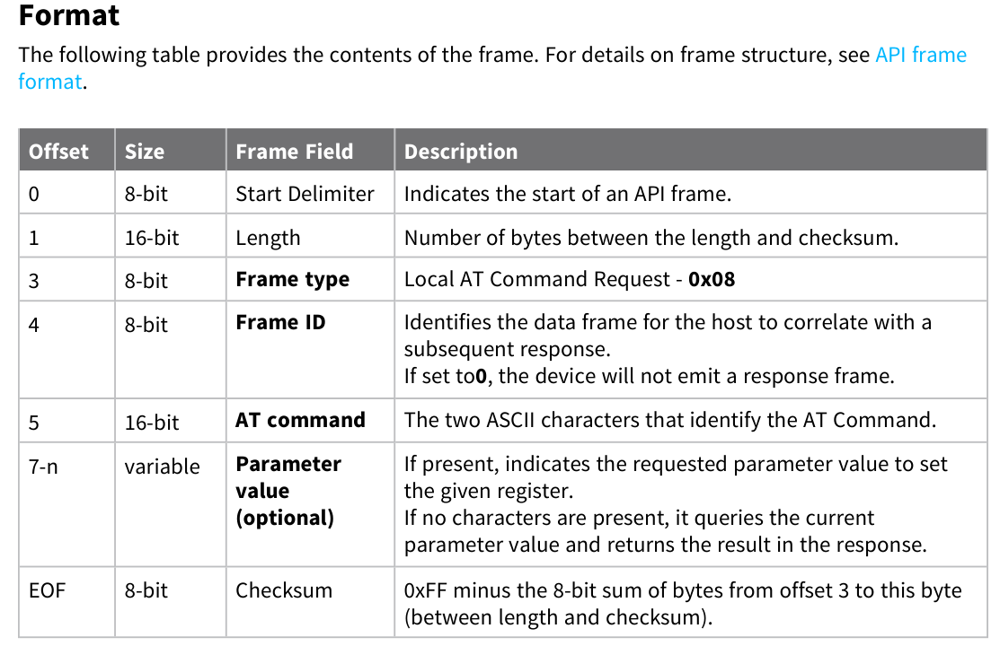

*Figura 12. Tabla original de solicitud AT local, Digi 90002173 Y, p. 125.*

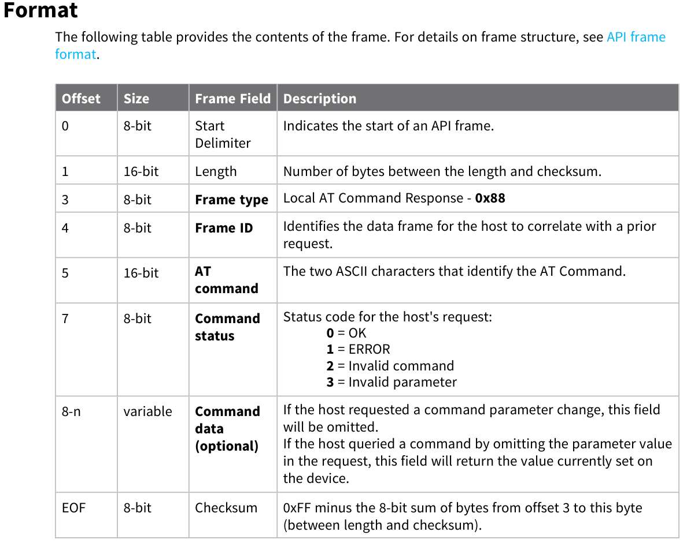

*Figura 13. Tabla original de respuesta AT local, Digi 90002173 Y, p. 141.*

| Campo | Índice en datos de `0x08` | Índice en datos de `0x88` |
|---|---|---|
| Tipo | 0 | 0 |
| Frame ID | 1 | 1 |
| Comando, dos bytes | 2–3 | 2–3 |
| Estado | No existe | 4 |
| Parámetro o datos | Desde 4, opcional | Desde 5, opcional |

Ejemplo completo de consulta y respuesta de AP=1, usando Frame ID 1:

```text
Solicitud: 7E 00 04 08 01 41 50 65
Respuesta: 7E 00 06 88 01 41 50 00 01 E4
```

La respuesta dice: tipo `88`, correlación `01`, comando AP (`41 50`), estado cero y valor uno. No contiene la cadena ASCII `"1"`, que sería `31`.

<a id="seccion-11-2"></a>

### 11.2 Solicitud remota 0x17 y respuesta 0x97

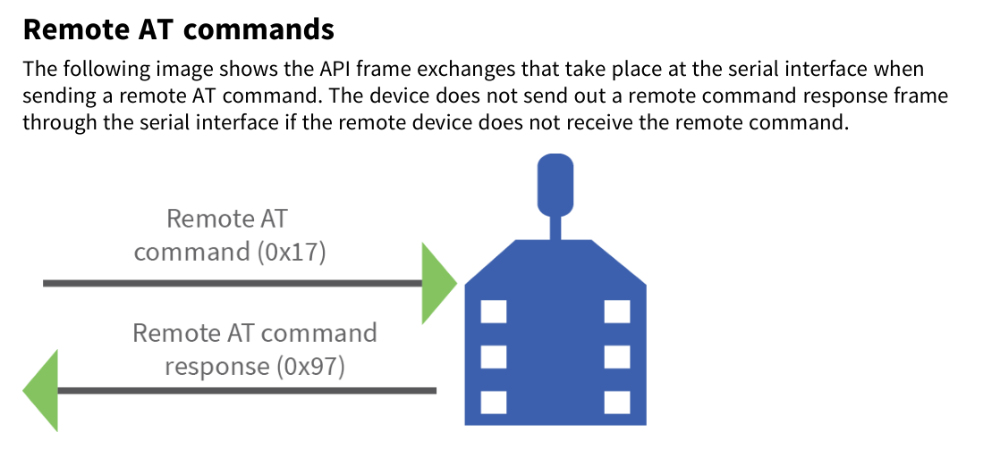

*Figura 14. Envoltura serial de solicitud y respuesta remota. Digi 90002173 Y, p. 119. La MAC del destinatario está dentro de la solicitud; el radio local gestiona su envío RF.*

La solicitud `0x17` incorpora la MAC del equipo que debe ejecutar el comando, un campo reservado de dos bytes, opciones y las dos letras del AT. El código utiliza el reservado `FF FE` y opciones `00`. Con opciones cero no deshabilita ACK ni pide aplicación inmediata del parámetro; deja preparado el cambio para aplicar después con AC. [M, pp. 136–137]

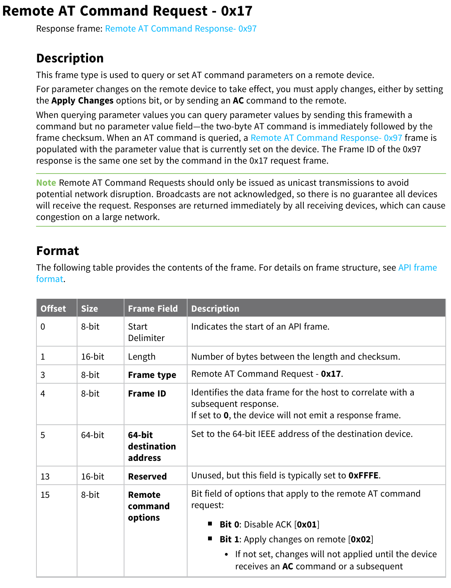

*Figura 15. Solicitud AT remota y campos iniciales. Digi 90002173 Y, p. 136.*

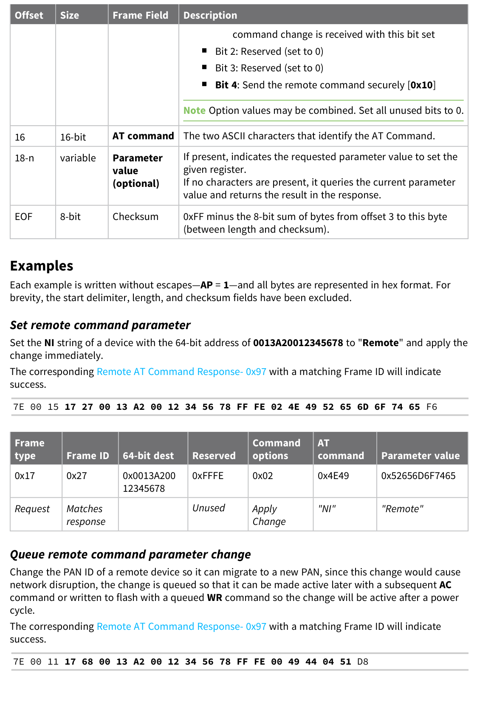

*Figura 16. Continuación de 0x17 y ejemplo de cambio de red preparado. Digi 90002173 Y, p. 137.*

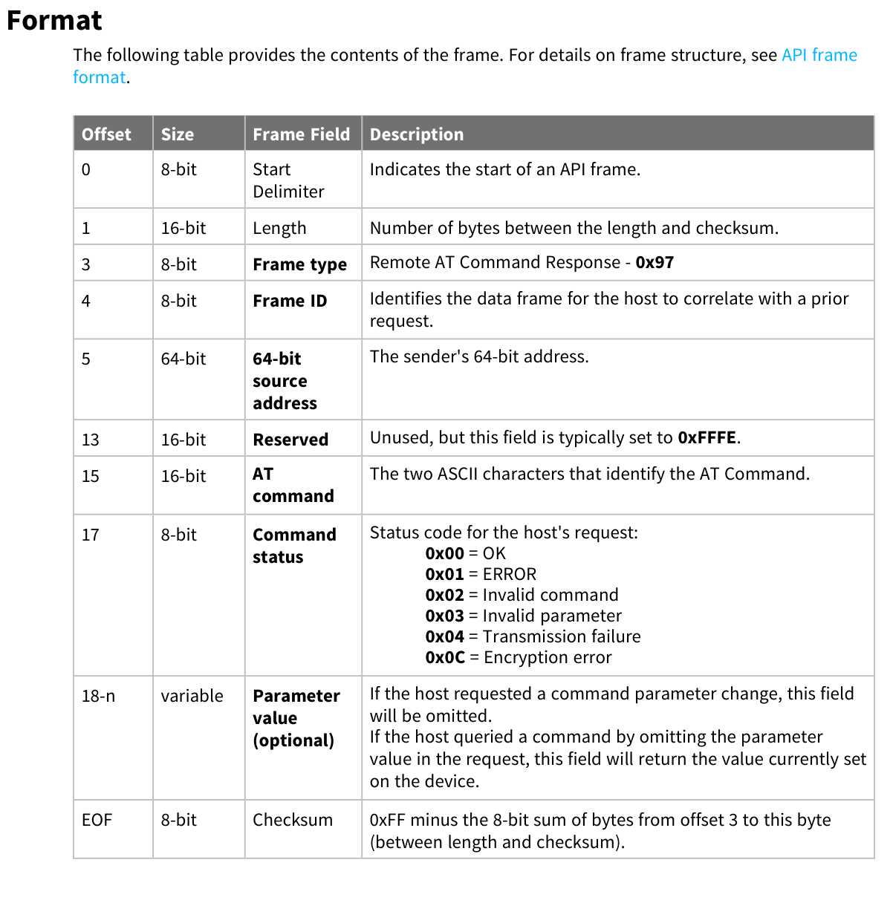

*Figura 17. Respuesta AT remota, Digi 90002173 Y, p. 163.*

| Campo | Índice en datos de `0x17` | Índice en datos de `0x97` |
|---|---|---|
| Tipo | 0 | 0 |
| Frame ID | 1 | 1 |
| MAC destino o emisor | 2–9 | 2–9 |
| Reservado | 10–11 | 10–11 |
| Opciones | 12 | No existe |
| AT, dos bytes | 13–14 | 12–13 |
| Estado | No existe | 14 |
| Parámetro o datos | Desde 15 | Desde 15 |

En la respuesta remota no está el byte de opciones de la solicitud: por eso las letras del comando se buscan en posiciones diferentes. `enviarComandoApi` fija `posicionComando=2` para local y `12` para remoto.

Ejemplo construido para consultar ID al remoto `0013A20040B9B5D2`, Frame ID 1:

```text
Solicitud: 7E 00 0F 17 01 00 13 A2 00 40 B9 B5 D2 FF FE 00 49 44 28
```

Los dos bytes `49 44` identifican ID. No sigue un parámetro porque es una consulta. Si la consulta remota falla por pérdida de comunicación, el código debe conservar la diferencia entre no haber recibido una respuesta y haber recibido un estado distinto de cero.

La validación de dirección del programa exige ocho bytes y rechaza cero y la dirección de difusión `000000000000FFFF`. Eso evita configurar la red completa por accidente, pero no prueba que cualquier otra dirección de ocho bytes corresponda a un equipo real. Su disponibilidad se comprueba después por comunicación.

<a id="seccion-11-3"></a>

### 11.3 Datos de sensores 0x90

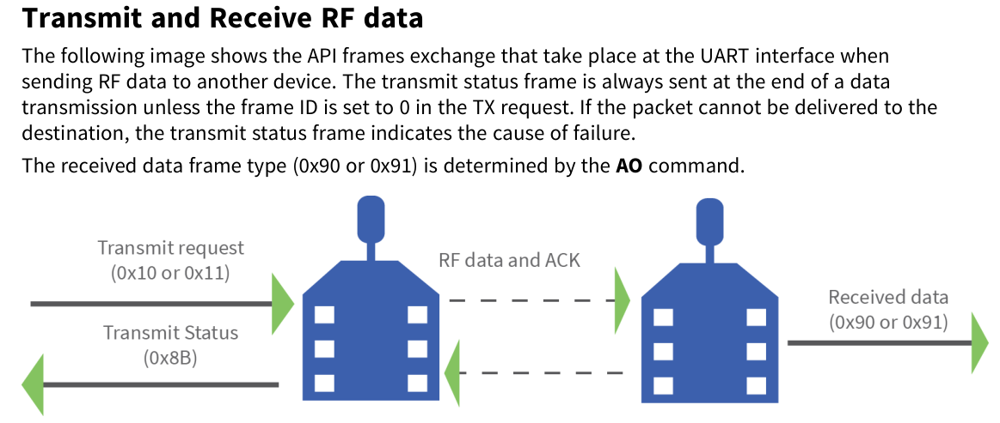

*Figura 18. Transmisión RF y tramas seriales asociadas, Digi 90002173 Y, p. 119.*

`0x90` representa datos recibidos, normalmente con AO=0. No es una respuesta AT y no tiene Frame ID de correlación con una consulta ND. Contiene MAC de origen, dos bytes reservados, opciones de recepción y carga útil. [M, pp. 153–154]

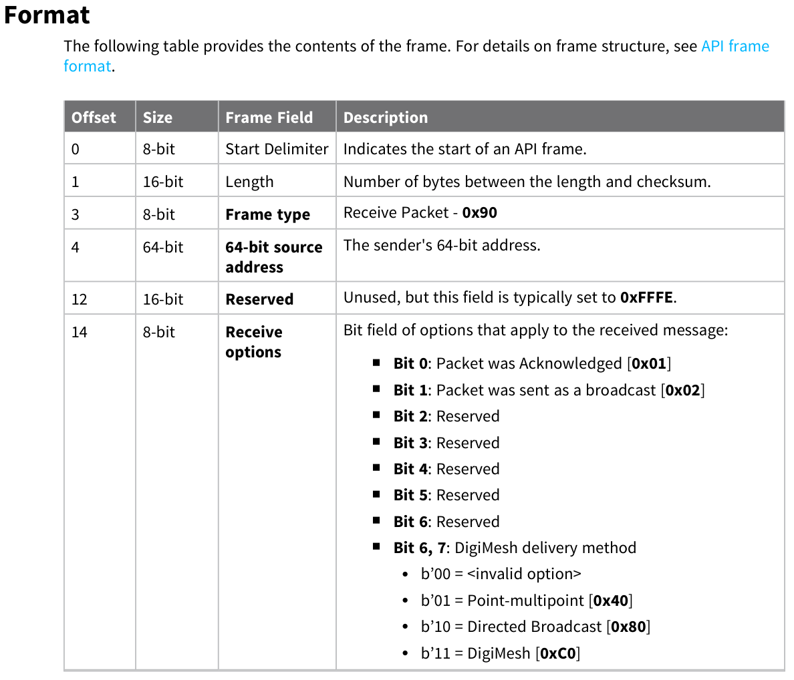

*Figura 19. Cabecera y opciones de recepción de 0x90. Digi 90002173 Y, p. 153.*

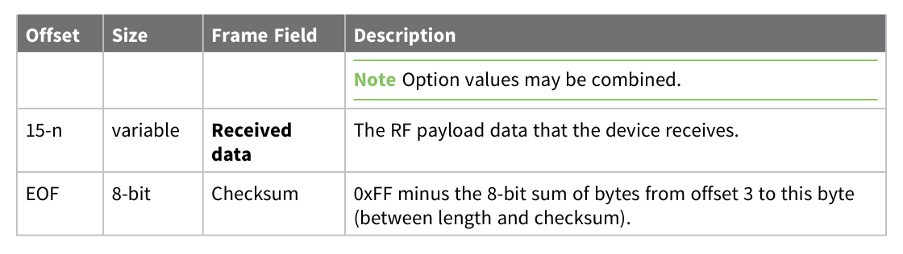

*Figura 20. Continuación de 0x90: carga útil y checksum. Digi 90002173 Y, p. 154.*

Dentro de los datos que devuelve `leerTramaApi`, la carga útil de `0x90` empieza en el índice 12: tipo en 0, MAC en 1–8, reservado en 9–10 y opciones en 11. En la trama completa corresponde al offset 15.

**0x90 no incluye un campo RSSI.** No se debe tomar un byte de su MAC o de sus opciones como si fuera la intensidad de señal. DB permite consultar el RSSI del último paquete, pero una consulta posterior no asocia por sí misma de manera infalible ese valor a un paquete determinado cuando existe tráfico concurrente. Este configurador no consulta DB; solo usa el RSSI que su analizador encuentra en ND. [M, pp. 81 y 153–154]

<a id="seccion-12"></a>

## 12 Construcción lectura y asociación de tramas

<a id="seccion-12-1"></a>

### 12.1 crearTramaApi y escaparDatosApi

`crearTramaApi` valida que `modo` sea `api_1` o `api_2`, construye la longitud de dos bytes, calcula checksum y concatena contenido. Si corresponde a API 2, escapa el contenido y añade después el `7E` inicial. Devuelve un objeto `bytes` listo para `puerto.write()`. [C, L1333–1396]

La función no valida semánticamente el comando ni la longitud máxima de 2048 del lector. Ese máximo protege la recepción de este programa; el campo de longitud sigue siendo de 16 bits. Los datos que construyen los llamadores son pequeños y conocidos.

<a id="seccion-12-2"></a>

### 12.2 leerByteApi

Lee un byte lógico, eliminando un escape API 2 si aparece. Si recibe `7D`, espera otro byte y aplica XOR con `20`; si vence el plazo después del escape, lanza `ErrorXBee`. Si no había un escape pendiente, un vencimiento produce `TimeoutError`. [C, L1399–1423]

**No tiene llamadas activas en el código examinado.** `leerTramaApi` implementa su propio procesamiento de escapes con un búfer persistente. Por tanto, sería incorrecto explicar el lector actual como una cadena de llamadas a `leerByteApi`.

El comentario que asocia `0x5E` con decimal 95 contiene un error numérico: `0x5E` es 94. Esto no cambia el resultado del XOR ejecutado.

<a id="seccion-12-3"></a>

### 12.3 leerTramaApi paso a paso

El estado se almacena en `puerto._bufferTramaApi`, con el modo, los bytes todavía pendientes y el momento de la última recepción. Se crea un estado nuevo si no existe o cambia API 1/API 2. [C, L1426–1537]

En cada iteración:

1. Busca el primer `7E` en los bytes pendientes. Descarta ruido anterior o vacía un búfer sin delimitador.
2. Recorre lo que sigue para reconstruir contenido lógico.
3. En API 2, deshace escapes. Un `7E` sin escapar dentro del contenido indica un nuevo comienzo y provoca resincronización.
4. Cuando tiene dos bytes lógicos, reconstruye longitud y exige que esté entre 1 y 2048.
5. Cuando reúne `longitud+3` bytes de contenido lógico —dos de longitud, datos y checksum— valida la suma.
6. Si el checksum es correcto, retira del búfer únicamente los bytes de esa trama y devuelve los datos internos.
7. Si la longitud o checksum no sirven, elimina el inicio candidato y vuelve a buscar una trama válida.
8. Si necesita más bytes, pide entre 1 y 512 según `in_waiting`.
9. Si hubo silencio por más de 0,5 s y quedaron datos incompletos, elimina un byte del candidato para evitar quedar bloqueado por una cabecera falsa.
10. Si vence el plazo global, lanza `TimeoutError` conservando el estado aún pendiente que no haya sido descartado.

La conservación de bytes permite atender una trama partida entre llamadas. No significa que cualquier trama parcial se conserve indefinidamente: existe el límite de inactividad entre bytes. En API 1 un `7E` puede aparecer dentro de datos; no se trata automáticamente como un nuevo inicio mientras el candidato tenga longitud coherente. En API 2 ese byte, si no está escapado, tiene significado especial de delimitación.

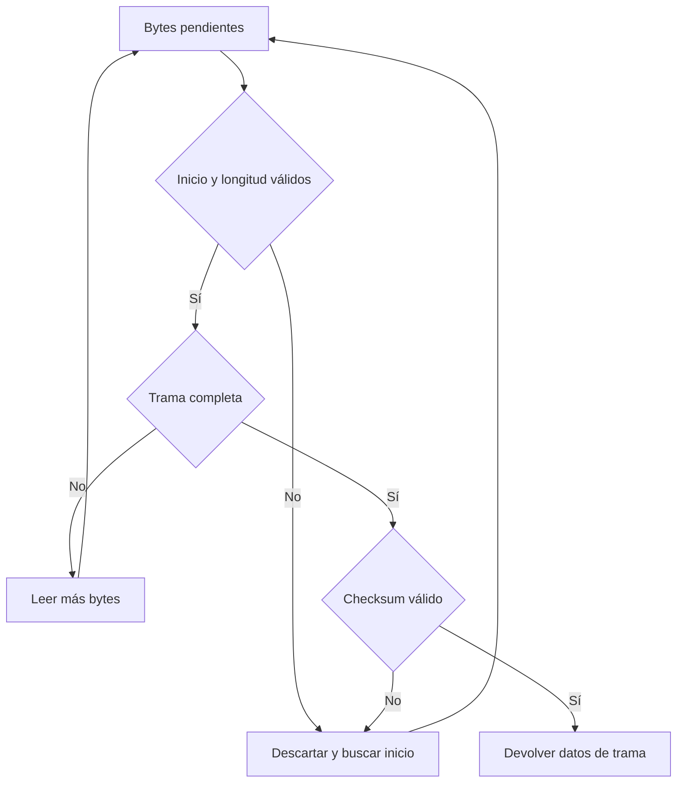
```mermaid
flowchart TD
    A["Bytes pendientes"] --> B{"Inicio y longitud válidos"}
    B -->|"No"| C["Descartar y buscar inicio"]
    C --> A
    B -->|"Sí"| D{"Trama completa"}
    D -->|"No"| E["Leer más bytes"]
    E --> A
    D -->|"Sí"| F{"Checksum válido"}
    F -->|"No"| C
    F -->|"Sí"| G["Devolver datos de trama"]
```

El lector no interpreta NI, ID ni ND. Tampoco rechaza `0x90`: devuelve cualquier trama completa válida, para que el nivel superior seleccione lo que necesita. Filtrar el tipo antes de reconstruir una trama completa podría dejar bytes de sensor mezclados con la siguiente respuesta.

<a id="seccion-12-4"></a>

### 12.4 enviarComandoApi

Es el transporte común de comandos sencillos locales y remotos. ND, al producir múltiples resultados, tiene su propio recorrido en `descubrirNodosApi`. [C, L1555–1648]

La función realiza estas tareas:

1. Decide si se permiten dos intentos: únicamente para consultas remotas sin parámetro, excluyendo AC, WR y CN.
2. Asigna un Frame ID nuevo a cada intento.
3. Codifica las dos letras del comando y comprueba su tamaño.
4. Construye `0x08` si no hay MAC, o `0x17` si hay destino remoto.
5. Añade NI como ASCII; otros parámetros como enteros binarios big-endian. ID y NT ocupan dos bytes; los demás, al menos uno y los necesarios según su valor.
6. Envía mediante `crearTramaApi` sin vaciar el búfer serial.
7. Lee tramas hasta obtener la suya o agotar el tiempo.
8. Verifica tamaño mínimo, tipo, Frame ID, comando y, para remoto, MAC.
9. Interpreta el estado y devuelve texto NI, entero de consulta o `"OK"` de escritura/control.

No vaciar la entrada antes de un comando API evita cortar una trama que ya estaba llegando. Las respuestas anteriores y los datos ajenos se consumen, pero se descartan si no coinciden con los criterios. No existe una cola para entregarlos después a otro proceso.

Los reintentos se activan por ausencia de respuesta o estado 4. Un estado 2 o 3 no se corrige repitiendo idénticamente la orden. Cada consulta remota puede consumir aproximadamente dos ventanas de 10 s y una pausa de 0,25 s; las operaciones con muchas consultas pueden tardar bastante más de 10 s.

Las escrituras no se repiten automáticamente por el transporte. Perder el OK de WR no permite saber si el guardado ocurrió; reenviar a ciegas podría interactuar con cambios de estado posteriores. Las decisiones de recuperación quedan en las funciones de operación.

Para NI remoto se usa `decode(...,errors="replace").rstrip("\x00")`, mientras el camino textual usa `strip()`. Esta diferencia puede importar para nombres con espacios extremos. El menú evita crearlos, pero un módulo configurado por otra herramienta podría contenerlos.

<a id="seccion-13"></a>

## 13 Descubrimiento de nodos en la misma red

<a id="seccion-13-1"></a>

### 13.1 prepararDescubrimientoApi

Antes de enviar ND, entra por AT de texto con aislamiento, lee configuración local, recupera el AP original en el diccionario, consulta NO y NT y sale confirmando AP/CN. Devuelve `(configuracion, modoApi, opcionesNo, tiempoNt)`. NT se convierte a segundos mediante multiplicación por 0,1. [C, L1867–1900]

Si el AP original es cero, informa que se necesita API 1 o API 2 y remite a la opción 2. No cambia silenciosamente el AP definitivo para habilitar la búsqueda. La restauración se ejecuta incluso si esta validación o una consulta falla.

<a id="seccion-13-2"></a>

### 13.2 NO NT y N?

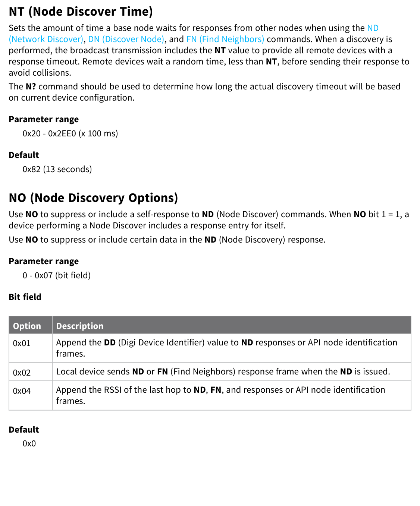

*Figura 21. Tiempo NT y opciones NO. Digi 90002173 Y, p. 88.*

NT determina una ventana de respuesta y los remotos usan un retardo aleatorio para evitar responder todos simultáneamente. `N?` informa el tiempo de descubrimiento que depende de la configuración; el propio manual recomienda consultarlo. [M, pp. 88 y 90]

`obtenerTiempoDescubrimiento` intenta leer `N?` por API, divide milisegundos entre 1000 y devuelve:

```python
max(tiempoNt, tiempoReal) + 2.0
```

Solo usa NT como respaldo cuando `N?` responde con estado 1, 2 o 3. Un timeout o fallo de transmisión de esa consulta no se encubre como comando no soportado. [C, L1750–1759]

Aunque existe una constante de 60 s, **los caminos normales del menú pasan el tiempo calculado con N? explícitamente y no lo recortan a 60 s**. El límite se aplica al valor predeterminado de `descubrirNodosApi` si no se le entrega `tiempoEspera`. Confundir ambos caminos llevaría a estimar mal el tiempo de un barrido.

| Bit NO | Efecto que interpreta el programa |
|---:|---|
| `0x01` | Añade cuatro bytes de identificador de tipo Digi |
| `0x02` | Permite incluir al propio radio local en el descubrimiento |
| `0x04` | Añade un byte de RSSI del último salto |

Se prueban con `opcionesNo & mascara`, por lo que pueden coexistir. NO=5 activa `0x01` y `0x04`. El programa lee NO, pero no lo modifica para forzar la inclusión de RSSI.

<a id="seccion-13-3"></a>

### 13.3 Una respuesta 0x88 por cada hallazgo

`descubrirNodosApi` construye el comando `08 + Frame ID + ND`, lo envía y procesa múltiples `0x88` que coincidan con identificador y comando. El estado debe ser cero. Una respuesta coincidente sin datos se interpreta como finalización; en ausencia de ella, se espera hasta el plazo. [C, L1986–2086]

Cuando hay datos:

1. Llama a `analizarRespuestaNd`.
2. Si el formato es inválido, muestra aviso con los bytes originales y continúa buscando otros resultados.
3. Guarda el nodo en un diccionario cuya clave es MAC, evitando duplicados.
4. Ejecuta el callback de guardado, si se suministró.
5. Muestra NI, MAC y RSSI si existe.

Al terminar cada intento consulta AP por API. Esto distingue «no respondió ningún remoto» de «el enlace serial local dejó de funcionar». Si no hubo remotos, repite ND una vez. Si recibió respuestas que no pudo interpretar y no obtuvo remotos válidos, informa un error de interpretación. Si obtuvo algún remoto válido, puede terminar mostrando ese subconjunto aunque otras respuestas hayan sido rechazadas: la lista no certifica descubrimiento exhaustivo.

`puerto._descubrimientoHasta` conserva el plazo de un ND en curso para que la recuperación sepa si todavía necesita esperar su finalización tras una cancelación.

<a id="seccion-13-4"></a>

### 13.4 Dos formatos ND y una discrepancia del manual

La página 90 del manual enumera SH, SL, DB y NI al principio de ND. El código admite esa disposición y otra que empieza por `FF FE`, incluye SH/SL después y añade otro reservado `FF FE` tras NI. La reconoce como formato DigiMesh. [C, L1903–1983]

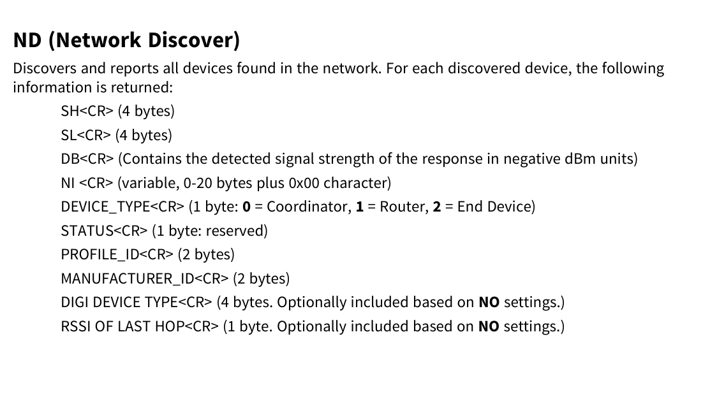

*Figura 22. Campos que enumera ND en Digi 90002173 Y, p. 90.*

| Campo | Formato denominado `digimesh` en el código | Formato denominado `900hp_antiguo` en el código |
|---|---|---|
| Inicio | MY/reservado `FF FE`, 2 bytes | SH directamente |
| Dirección | SH, 4 bytes; SL, 4 bytes | SH, 4 bytes; SL, 4 bytes |
| RSSI antes del nombre | No existe | DB, 1 byte |
| Nombre | NI ASCII seguido de `00` | NI ASCII seguido de `00` |
| Después de NI | Padre/reservado `FF FE` | Tipo directamente |
| Base final | Tipo, estado, perfil de 2 bytes, fabricante de 2 bytes | La misma base final |
| Opcionales | DD y RSSI según NO | DD y RSSI según NO |

**El nombre `900hp_antiguo` es una etiqueta de la implementación, no una cronología demostrada por este PDF.** La estructura con MY y padre aparece en la página 91 para FN y una disposición relacionada se documenta para `0x95` en pp. 160–161. Eso no autoriza a afirmar que la página 90 documenta textualmente ese mismo ND. Se debe conservar el ND real, `nd_hex`, y relacionarlo con el firmware probado para resolver la discrepancia en cada equipo.

Esta precisión explica por qué no debe desplazarse la MAC a ciegas ni tomar su byte inicial como RSSI. El analizador elige la disposición por los dos primeros bytes `FF FE` y valida el resto. Es una compatibilidad implementada, cuya correspondencia con el hardware requiere las tramas reales.

<a id="seccion-13-5"></a>

### 13.5 analizarRespuestaNd paso a paso

1. Rechaza respuestas de menos de 16 bytes.
2. Decide el formato examinando los primeros dos bytes.
3. Extrae SH/SL y forma la MAC.
4. Exige que la MAC empiece por `0013A2`.
5. Localiza el terminador cero de NI.
6. Exige nombre ASCII imprimible de no más de 20 bytes.
7. Para el formato DigiMesh, comprueba el reservado/padre `FF FE`.
8. Lee tipo, estado, perfil y fabricante.
9. Exige tipo 0, 1 o 2 y estado cero.
10. Lee DD y/o RSSI adicionales según NO.
11. Exige que todos los bytes queden exactamente consumidos.
12. Devuelve el nodo interpretado junto con `nd_hex` y `formato_nd`.

La comprobación del prefijo MAC es una restricción defensiva del programa. No es una validación general de todas las direcciones que Digi haya podido asignar. Perfil y fabricante se extraen y presentan, pero no se exige que sean unos valores concretos. El rechazo de bytes finales desconocidos también podría rechazar una extensión legítima de firmware futuro.

Ejemplo sintético de ND con NO=0, no capturado de un radio:

```text
FF FE 00 13 A2 00 40 B9 B5 D2 4E 4F 44 4F 31 00 FF FE 01 00 C1 05 10 1E
```

Su interpretación es MAC `0013A20040B9B5D2`, NI `NODO1`, tipo 1, estado 0, perfil `C105`, fabricante `101E` y RSSI ausente. Con NO=4 se añade al final, por ejemplo, `40`, que el código interpreta como −64 dBm. El `00` que termina NI es parte del formato ND, no el fin de toda la trama API.

<a id="seccion-13-6"></a>

### 13.6 RSSI ausente y RSSI del último salto

En el formato DigiMesh de este analizador, si NO no incluye `0x04`, `rssi_dbm` queda en `None`. La pantalla imprime «RSSI no incluido» y el JSON puede almacenar `null`. Ninguno significa 0 dBm ni una señal de intensidad cero.

En el formato alternativo, el byte DB situado antes del nombre produce un valor negativo. Si además existe el opcional del último salto, se conserva por separado. El parser rechaza DB mayor que 127 en ese formato; para el opcional DigiMesh mayor que 127 devuelve `None`. Es una política del código que no debe confundirse con una medición física.

En una ruta de varios saltos, el RSSI del último salto describe el enlace de la última recepción, no una potencia acumulada de toda la ruta. El tipo de nodo reportado por ND tampoco sustituye a consultar CE: el descubrimiento no devuelve AP y CE como registros de configuración.

<a id="seccion-13-7"></a>

### 13.7 operacionDescubrir en la red actual

La opción 3 prepara API, entra en `conservarRedLocal` y ofrece misma red u otra red. En misma red:

1. Calcula la espera.
2. Envía ND y guarda cada nodo mediante un callback.
3. Filtra la MAC local y añade a cada remoto el ID de la red visitada.
4. Guarda el conjunto final de nodos.
5. Intenta verificar los remotos pendientes descubiertos.
6. Muestra resultados con `mostrarNodosDescubiertos`.
7. Antes de cerrar el puerto, verifica/restaura la configuración local.

`mostrarNodosDescubiertos` solo presenta datos: número de nodos, NI, MAC, ID si existe, tipo y RSSI. No inicia una segunda búsqueda. [C, L2089–2115 y L2427–2456]

<a id="seccion-14"></a>

## 14 Búsqueda en intervalos y visitas temporales de red

<a id="seccion-14-1"></a>

### 14.1 Qué se busca realmente

El barrido recorre valores de **ID**, no frecuencias, velocidades, contraseñas ni todos los perfiles posibles. Para comunicarse deben ser compatibles también HP, canales activos, firmware y cifrado. El código conserva esas dimensiones. [M, pp. 68 y 78–80; C, L1802–1861]

El hecho de conocer una MAC no permite dirigirse a ella desde una red RF incompatible. Para consultar un nodo con otro ID, el XBee local debe visitar temporalmente ese ID.

<a id="seccion-14-2"></a>

### 14.2 cambiarIdTemporal

Valida el rango, envía un comando API local `0x08` para establecer ID y consulta ID hasta tres veces. Si la respuesta a la escritura se pierde o informa estado 4, continúa hacia la lectura de comprobación porque el cambio podría haberse aplicado. Otros errores se propagan. Espera 0,1 s cuando confirma el valor. [C, L1652–1679]

**No usa WR.** El ID queda activo en memoria y la operación exterior se encarga de volver al ID inicial. Reiniciar recuperaría el ID guardado en flash, que no tiene por qué coincidir con el ID activo inicial si existían cambios previos sin guardar.

<a id="seccion-14-3"></a>

### 14.3 pedirRangoRed y elegirRed

`elegirRed` acepta 1, 2 o 0. No cambia ningún registro. `pedirRangoRed` acepta un valor hexadecimal, un intervalo inclusivo como `0009-0010`, o Enter para todo `0000-7FFF`. Convierte el guion largo admitido en guion simple y comprueba orden y límites. [C, L1762–1792]

El rango `0009-0010` contiene **ocho** valores: 9, A, B, C, D, E, F y 10 hexadecimal. No son solo dos redes. El intervalo completo contiene 32768 ID.

<a id="seccion-14-4"></a>

### 14.4 buscarEnRango

Solicita el rango, calcula un presupuesto aproximado y crea un registro de progreso. Para cada ID:

1. Guarda `id_actual` y `siguiente_id` con el ID que va a comenzar.
2. Cambia temporalmente el radio local y verifica la lectura.
3. Crea una copia de la configuración local con el ID visitado.
4. Ejecuta ND.
5. Por cada hallazgo, la función anidada `alEncontrar` excluye la MAC local, añade ID y guarda inmediatamente el nodo.
6. Si existe `rutaPuerto`, intenta cerrar configuraciones pendientes confirmables.
7. Actualiza `siguiente_id` al próximo ID después de completar la red actual.

`encontrados` usa MAC como clave para no duplicar nodos. El callback conserva resultados aunque después se cancele ND. No transforma un descubrimiento en una configuración completa: AP y CE siguen sin provenir de ND.

Si el usuario cancela, marca `cancelada`, conserva lo encontrado y retorna esos nodos. Si ocurre otra excepción normal, marca `interrumpida_por_error` y la propaga. El `finally` escribe la fecha final y el punto de continuación. El contexto exterior realiza la restauración del radio.

<a id="seccion-14-5"></a>

### 14.5 Tiempo y reanudación

El presupuesto que muestra el código es:

```text
horas = cantidad_ID × [2 × (espera_ND + 2 s) + 0,1 s] / 3600
```

Con una espera ilustrativa de 21,8 s, todo el intervalo daría unas 434,18 horas en esta fórmula. Es un **presupuesto de esperas**, no una predicción ni un máximo garantizado: algunas búsquedas terminan antes, y comandos, escrituras de archivo, verificaciones remotas o reintentos pueden añadir tiempo.

No existe reanudación automática al reiniciar el programa. El JSON conserva `siguiente_id`, y la pantalla propone el rango que el usuario debe introducir después. Si se canceló una red a la mitad, se vuelve a proponer ese mismo ID, porque todavía no se completó su búsqueda.

Además, `ultimo_descubrimiento` es una instantánea reciente, no toda la historia del barrido. Los nodos acumulados permanecen en `modulos`; los callbacks pueden reemplazar esa instantánea con un único hallazgo antes de que se escriba un conjunto final.

<a id="seccion-15"></a>

## 15 Recuperación de ID y AP del XBee local

<a id="seccion-15-1"></a>

### 15.1 protegerRestauracion

Este administrador de contexto conserva el manejador actual de SIGINT, establece temporalmente `SIG_IGN` y lo repone en un `finally`. Dentro del bloque, un segundo Ctrl+C no interrumpe la recuperación que ya está en curso. [C, L1683–1689]

No protege de desconectar USB, cortar alimentación, finalizar el proceso forzosamente o apagar la Raspberry. Tampoco hace que la operación original tenga éxito: solo permite intentar dejar un estado local conocido antes de devolver el control. La implementación de señales está pensada para el hilo principal del programa.

<a id="seccion-15-2"></a>

### 15.2 conservarRedLocal

Recibe el puerto abierto, modo API y configuración local inicial. Conserva ID y AP y ejecuta el cuerpo del `with` a través de `yield`. Tanto al terminar normalmente como al propagarse un error pasa por el bloque de recuperación. [C, L1693–1747]

En los dos primeros intentos:

1. Consulta ID por API.
2. Si no es el original, llama a `cambiarIdTemporal` para devolverlo y comprobarlo.
3. Consulta AP y exige que coincida con el inicial.

Si falla el primer intento y `_descubrimientoHasta` indica que un ND cancelado todavía podría estar activo, espera ese plazo leyendo y descartando tramas. Después continúa la recuperación. Esto evita concluir demasiado pronto que la API ya no responde mientras el radio sigue ocupado en el descubrimiento.

El tercer intento usa el camino AT de texto: entra por `+++`, escribe ID original, consulta ese registro y ejecuta `salirModoComando` con el AP original. En esta ruta la lectura de ID ocurre antes de CN y la comprobación binaria final valida AP. No es una segunda prueba RF de pertenencia a la red original; es una recuperación basada en comandos, lecturas y transición de modo.

No se ejecuta WR para estos cambios temporales. Si todos los intentos fallan, se lanza un error que indica que la restauración no pudo confirmarse, conservando información del fallo original cuando existe. En ese caso no puede asumirse que ID/AP quedaron bien solo porque se llegó al menú.

<a id="seccion-15-3"></a>

### 15.3 Qué restaura y qué no

| Elemento | Recuperación prevista |
|---|---|
| ID local activo antes de búsqueda o visita | Se intenta restablecer y leer |
| AP local inicial | Se comprueba; el respaldo AT intenta reponerlo |
| GT anterior al arranque | No se recupera; el proyecto fija 500 ms |
| ID/AP/CE/NI remotos ya guardados | Los controla otro flujo; no se revierten al restaurar el local |
| Tráfico de sensores recibido durante el uso | No se repone ni reenvía al receptor |
| Parámetros ajenos como HP/CM | No se modifican durante el barrido |

Una operación remota puede quedar pendiente mientras el XBee local sí se recupera correctamente. Son dos resultados diferentes y deben registrarse por separado en los ensayos.

<a id="seccion-16"></a>

## 16 Selección y lectura de un módulo remoto

<a id="seccion-16-1"></a>

### 16.1 comprobación de módulos registrados

`comprobarModulosRegistrados` se usa cuando la opción 5 solicita configurar dentro de otra red. **No hace un barrido nuevo de todas las redes.** Parte del JSON y consulta únicamente las MAC y los ID conocidos. [C, L2121–2177]

Primero reúne `modulos` y, como compatibilidad con registros anteriores, hallazgos de `ultimo_descubrimiento` cuya MAC no estuviera en esa lista. Normaliza MAC a mayúsculas, descarta direcciones mal formadas, cero, broadcast y la MAC local. Rechaza específicamente registros que empiezan por `FFFE0013`, patrón que indica una MAC desplazada por un análisis anterior incorrecto.

Para cada módulo reúne su ID conocido y `ids_por_verificar`. Agrupa por ID válido, excluyendo la red local original. Visita esas redes por orden y consulta NI remoto por MAC. Si recibe respuesta, considera confirmada la disponibilidad en ese momento, guarda el avistamiento y añade el nodo a la lista seleccionable. Si no responde con los errores API contemplados, informa que no pudo confirmar disponibilidad y continúa.

Leer NI demuestra que hubo una consulta remota válida; no comprueba todavía todos los parámetros ni cierra la marca pendiente. Una vez confirmado un módulo se evita añadirlo de nuevo si aparece entre candidatos de otra red.

<a id="seccion-16-2"></a>

### 16.2 seleccionarModuloRemoto

Muestra los nodos encontrados o comprobados **en la operación actual**, con NI, MAC e ID. Acepta un número de esa lista o cero para volver; las entradas inválidas repiten la pregunta. No permite introducir cualquier MAC manualmente en este menú. [C, L2180–2199]

La selección se basa en MAC y no solo en NI, porque los nombres pueden repetirse o cambiar. Aun así, el programa vuelve a comprobar la dirección al leer SH/SL del módulo seleccionado.

<a id="seccion-16-3"></a>

### 16.3 leerConfiguracionRemota

Consulta ID, AP, CE, NI, SH y SL a través de `enviarComandoApi(...,mac=...)`, forma la MAC con SH/SL y la compara con el destino. Luego consulta VR, BD, HP, CM, DH y DL. [C, L2202–2220]

Para los adicionales solo convierte en `None` estados 1, 2 o 3 de `ErrorComandoApi`. Ausencia de respuesta, fallo de transmisión y otros problemas se propagan. Esto evita presentar una lectura remota incompleta por pérdida de enlace como si todo hubiera terminado correctamente.

No cambia AP del radio remoto para leerlo. La sesión API es la de la conexión Raspberry–XBee local. Puede consultar un remoto configurado en transparente sin pedir intervención del ESP32.

<a id="seccion-16-4"></a>

### 16.4 operacionConfigurarRemoto

La opción 5 conserva el puerto abierto durante la operación, prepara API y utiliza `conservarRedLocal`. Dentro de ese contexto:

1. El usuario elige misma red u otra red registrada.
2. En misma red se ejecuta ND; en otra red se comprueban los candidatos guardados.
3. Si no hay disponibles, termina informándolo.
4. El usuario selecciona el módulo.
5. El local visita su ID y se leen los parámetros remotos.
6. Se solicitan los cuatro valores nuevos.
7. Si cambia ID, se advierte que el remoto saldrá de la red actual.
8. Se pide confirmación identificando la MAC.
9. Se ejecuta `configurarModuloRemoto` y se muestra la configuración final si termina.
10. El contexto restaura ID/AP locales antes de cerrar el puerto.

Durante la introducción de valores no se mantiene abierto modo comando AT en el remoto; el local está en API. Por eso la espera del usuario no presenta el mismo problema de CT que una sesión textual dejada abierta. El tráfico que llegue mientras el usuario decide puede acumularse en búferes y no existe una garantía de captura de telemetría durante esa espera. [C, L2459–2502]

<a id="seccion-17"></a>

## 17 Configuración remota y cambios de red

<a id="seccion-17-1"></a>

### 17.1 Registrar antes de escribir

`registrarIntentoRemoto(actual,nueva)` carga el JSON, encuentra la MAC o crea una entrada mínima y guarda:

- `ids_por_verificar`: ID anterior y nuevo, sin duplicados.
- `configuracion_solicitada`: los cuatro valores que se pretenden escribir.
- `estado_configuracion`: `pendiente_de_verificar`.

Lo hace **antes de enviar las escrituras**. Si ese guardado falla, no se inicia esa fase de configuración remota. Si el proceso pierde comunicación después, el archivo conserva qué redes podrían contener al módulo. [C, L2223–2237]

<a id="seccion-17-2"></a>

### 17.2 Preparar y guardar sin abandonar todavía la red

`configurarModuloRemoto` envía, en este orden, CE, NI, AP e ID por `0x17` con opciones `00`. ID queda al final. Luego activa `intentoGuardar=True` y envía WR remoto. [C, L2276–2290]

El motivo del orden y de no establecer el bit Apply Changes es mantener la comunicación en la red anterior mientras se prepara y confirma el guardado. Si ID se aplicara inmediatamente al inicio, los comandos posteriores podrían dejar de alcanzar el equipo.

No se debe interpretar cada `"OK"` de escritura como confirmación de toda la operación. Significa que ese comando obtuvo una respuesta con estado cero. La confirmación integral requiere lectura posterior y comparación de los cuatro parámetros.

<a id="seccion-17-3"></a>

### 17.3 Fallo durante la preparación o WR

Si ocurre una excepción, incluido Ctrl+C, dentro de esa primera fase, el código intenta recuperar los valores remotos anteriores bajo `protegerRestauracion`:

1. Reenvía CE, NI, AP e ID anteriores, todavía como comandos preparados.
2. Si se había intentado WR, envía WR con los valores anteriores, porque el primer guardado pudo haber llegado aunque no se recibiera confirmación.
3. Envía AC para aplicar esa recuperación.
4. Lee el remoto y compara con el estado anterior.
5. Si coincide, elimina del JSON las tres claves de pendiente.
6. Si no logra comprobarlo, conserva esas claves e informa que sigue sin confirmación.

Después vuelve a lanzar la excepción original: que la recuperación termine bien no convierte la configuración solicitada en una operación exitosa. [C, L2291–2318]

Existe una limitación del registro en esa recuperación: elimina las claves pendientes, pero no reconstruye necesariamente todos los datos de la entrada a partir de `recuperada`. Si los campos previos eran incompletos o antiguos, no hay que presentar esa entrada como una nueva lectura completa fechada. El código evita deliberadamente cambiar la fecha de configuración anterior.

<a id="seccion-17-4"></a>

### 17.4 Aplicar la configuración y visitar el ID nuevo

Cuando WR fue confirmado, envía AC remoto. Si pierde su respuesta o recibe estado 4, no da la operación por exitosa: anuncia que comprobará el equipo en el ID nuevo. Otros estados de error se propagan. [C, L2320–2329]

Después:

1. Cambia temporalmente el ID del XBee local al nuevo valor.
2. Intenta leer la configuración remota completa hasta tres veces cuando los fallos permiten reintento.
3. Compara ID, AP, CE y NI con `nueva`.
4. Si coinciden, actualiza la entrada por MAC y anuncia «guardada y verificada».
5. Si la fase no termina, conserva pendiente y avisa que WR ya fue confirmado y cancelar no deshace lo guardado.

Los reintentos exteriores de lectura no significan tres paquetes: cada lectura consulta varios comandos, y algunas consultas tienen además su propio reintento. Por ello el tiempo total puede exceder considerablemente los 10 s de una espera individual.

<a id="seccion-17-5"></a>

### 17.5 Diagrama de decisión de la operación remota

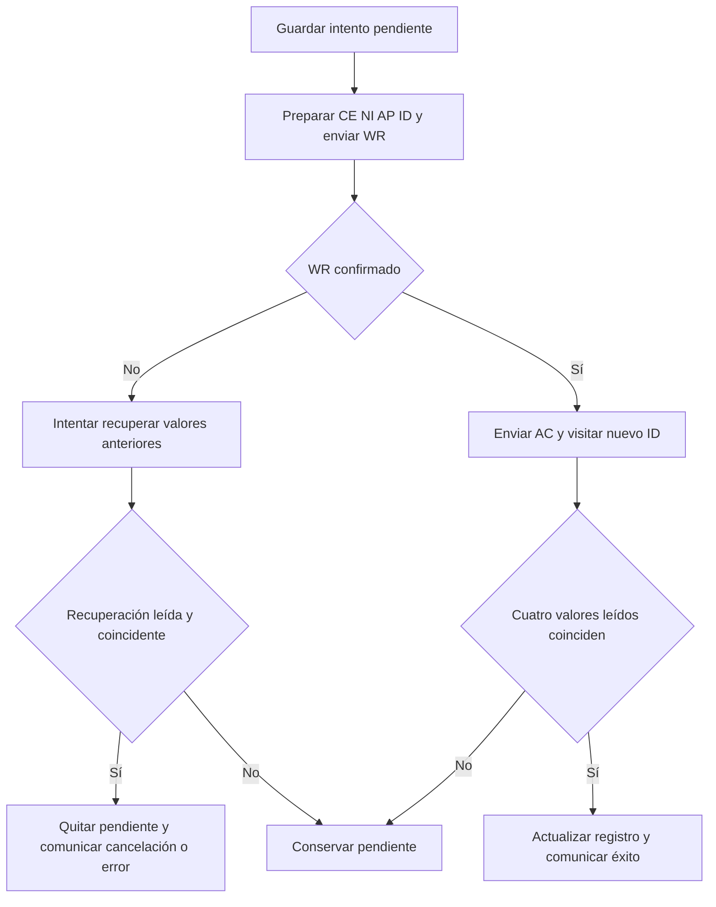
```mermaid
flowchart TD
    A["Guardar intento pendiente"] --> B["Preparar CE NI AP ID y enviar WR"]
    B --> C{"WR confirmado"}
    C -->|"No"| D["Intentar recuperar valores anteriores"]
    D --> E{"Recuperación leída y coincidente"}
    E -->|"Sí"| F["Quitar pendiente y comunicar cancelación o error"]
    E -->|"No"| G["Conservar pendiente"]
    C -->|"Sí"| H["Enviar AC y visitar nuevo ID"]
    H --> I{"Cuatro valores leídos coinciden"}
    I -->|"Sí"| J["Actualizar registro y comunicar éxito"]
    I -->|"No"| G
```

La restauración de ID/AP del local se ejecuta por fuera de este diagrama, al abandonar `conservarRedLocal`, cualquiera que sea el resultado remoto.

<a id="seccion-17-6"></a>

### 17.6 Ejemplo de migración de red

Supóngase un XBee local en ID `0001`, AP=1, y un remoto también en `0001`, AP=0. Se solicita al remoto ID `0009`, AP=0, CE=0 y NI `NODO9`.

| Momento | ID local activo | ID remoto activo esperado por el diseño | Evidencia buscada |
|---|---|---|---|
| Lectura inicial | 0001 | 0001 | Respuestas remotas con la MAC elegida |
| Preparación sin Apply Changes | 0001 | 0001 | Estado cero de cada escritura |
| WR remoto | 0001 | 0001 antes de aplicar | Confirmación de guardado |
| AC remoto | 0001 | Transición a 0009 | Puede perderse la respuesta al cambiar de red |
| Visita de verificación | 0009 | 0009 | Lectura completa y comparación |
| Salida de la operación | 0001 | 0009 si se confirmó la migración | Restauración local separada del éxito remoto |

En una red multihop, el remoto puede haber dependido de repetidores que siguen en `0001`. Al moverse a `0009`, aquella ruta puede desaparecer. Cambiar también el ID local no crea físicamente una ruta nueva ni amplía el alcance. Por eso el mensaje del programa exige que el nodo siga siendo alcanzable en su red final.

<a id="seccion-17-7"></a>

### 17.7 Verificación posterior de pendientes

`verificarConfiguracionesPendientes` se ejecuta desde la opción 3 al encontrar nodos, tanto en la misma red como durante un rango cuando se le proporcionó la ruta. Selecciona entradas marcadas pendientes y exige que exista una configuración solicitada con ID/AP/CE/NI. [C, L2240–2273]

Para cada MAC pendiente encontrada por ND, realiza una lectura AT remota completa. Si falla, conserva pendiente. Si los valores **no coinciden** con lo solicitado, también conserva pendiente. Solo al coincidir los cuatro llama a `guardarModuloEnRegistro`, que reemplaza la entrada y deja de incluir las claves pendientes.

Esto es más estricto que «se volvió a encontrar el nodo». Y también es más estricto que «ya se sabe cómo quedó»: si se lee una configuración distinta de la solicitada, el código actual no cierra el caso guardando esa otra configuración como resultado resuelto. La documentación no atribuye al programa esa capacidad adicional.

<a id="seccion-18"></a>

## 18 Registro JSON y significado de sus datos

<a id="seccion-18-1"></a>

### 18.1 cargarRegistro y escribirRegistro

Si el archivo no existe, `cargarRegistro` devuelve una estructura inicial con versión 1, fecha nula, lista vacía de módulos y descubrimiento nulo. Si existe, lo abre en UTF-8 y lo convierte con `json.load`. Un JSON ilegible o mal formado provoca `ErrorXBee`; no se reemplaza silenciosamente por un registro vacío. [C, L994–1040]

Después usa `setdefault` para añadir claves principales ausentes sin borrar otras. **No valida un esquema completo:** si el JSON es sintácticamente válido pero `modulos` tiene un tipo incorrecto, algunos fallos posteriores no se convierten limpiamente en el error previsto.

`escribirRegistro` actualiza `actualizado`, escribe todo en `xbee_configurados.json.tmp`, cierra el temporal y lo reemplaza sobre el archivo definitivo. Esto reduce la posibilidad de dejar el JSON final truncado si la escritura se interrumpe antes del reemplazo. No implementa bloqueo entre procesos, historial de versiones ni `fsync`; no debe describirse como garantía absoluta ante pérdida de alimentación o dos escritores concurrentes. [C, L1043–1057]

<a id="seccion-18-2"></a>

### 18.2 guardarModuloEnRegistro

Construye una entrada con MAC, NI, ID hexadecimal, AP, CE, nombre de función según CE, puerto, fecha, tipo local/remoto y MAC local intermediaria. Busca una entrada con la misma MAC y la **reemplaza completa**; si no existe, la añade. Finalmente guarda el archivo. [C, L1060–1155]

El `else` del `for` se ejecuta únicamente si el bucle terminó sin `break`, es decir, si no encontró esa MAC. Esto evita duplicados cuando un mismo equipo cambia de NI, ID o número de puerto USB.

La sustitución completa retira las claves pendientes al confirmar una configuración, pero también elimina campos anteriores no incluidos en la nueva entrada, como metadatos de avistamiento. No es una actualización histórica acumulativa.

<a id="seccion-18-3"></a>

### 18.3 guardarDescubrimiento

Carga el registro, excluye la MAC local y busca o crea cada remoto. Actualiza NI, ID de la red visitada, fecha de avistamiento, MAC desde la que se descubrió y RSSI si existe. Conserva AP y CE anteriores cuando estaban presentes, porque ND no los vuelve a medir. [C, L1246–1279]

El ID guardado aquí se infiere de la red local desde la que respondió el nodo; no es una consulta ATID remota. Si había una operación pendiente, las claves correspondientes se conservan. Un hallazgo puede actualizar NI/ID mientras AP/CE siguen siendo valores de una lectura anterior: las fechas y procedencias importan.

Después reemplaza `ultimo_descubrimiento` con una instantánea de esa llamada y escribe el archivo. Durante callbacks puede contener solo un hallazgo. No es una bitácora de todos los descubrimientos de todos los días.

<a id="seccion-18-4"></a>

### 18.4 registrarEstadoBusqueda

Recibe el diccionario de progreso, guarda una copia bajo `busqueda_redes` y escribe el JSON. El estado incluye rango, MAC local, ID original, ID en curso, siguiente ID, estado y fechas. La función no continúa el barrido ni decide por sí misma el próximo ID; esas decisiones se toman en `buscarEnRango`. [C, L1795–1799]

<a id="seccion-18-5"></a>

### 18.5 Ejemplo sintético de un módulo pendiente

El siguiente JSON sirve para explicar campos; no corresponde a una prueba realizada ni debe reemplazar el registro real:

```json
{
  "version": 1,
  "actualizado": "2026-10-02T12:00:00-05:00",
  "modulos": [
    {
      "mac": "0013A20040B9B5D2",
      "ni": "NODO1",
      "id": "0x0001",
      "ap": 0,
      "ce": 0,
      "ids_por_verificar": ["0x0001", "0x0009"],
      "configuracion_solicitada": {
        "ID": 9,
        "AP": 0,
        "CE": 0,
        "NI": "NODO9"
      },
      "estado_configuracion": "pendiente_de_verificar"
    }
  ],
  "ultimo_descubrimiento": null
}
```

`id` es un texto hexadecimal de presentación y búsqueda; `configuracion_solicitada.ID` es un entero JSON, expresado en decimal. Ambos pueden representar el mismo número sin tener la misma escritura. Una ausencia de AP/CE en una entrada creada solo por descubrimiento es válida dentro del funcionamiento del programa; no debe rellenarse inventando valores.

<a id="seccion-18-6"></a>

### 18.6 mostrarRegistro

Carga el JSON y muestra ruta y módulos. Sin argumento, numera las entradas; si `enum` es distinto de `None`, muestra guiones. En ambos casos avisa de configuración pendiente cuando hay `ids_por_verificar`. No prueba disponibilidad, no consulta radios y no modifica el archivo. [C, L1158–1243]

Por ello una MAC en la opción 4 no necesariamente está encendida ahora. Para ofrecerla en configuración remota se utiliza descubrimiento o comprobación de disponibilidad actual.

<a id="seccion-19"></a>

## 19 Interfaz terminal y estado visible

`dibujitoMenu` imprime las siete opciones. `lineaMenu` imprime título, ruta, baudios, NI cuando existe e ID si está confirmado; si no existe ID muestra «no confirmado». `mostrarMenu` combina ambas funciones sin consultar el equipo. [C, L2505–2539]

`limpiarTerminal` usa `sys.stdout.isatty()` para decidir si emite las secuencias ANSI de borrar pantalla y llevar el cursor al inicio. Cuando la salida está redirigida, evita esos códigos. Esto limpia lo mostrado; no borra archivos ni registros. [C, L2545–2548]

El encabezado conserva los últimos valores conocidos. No es telemetría continua de configuración. Tras un error de la opción 2, `main` pone el ID visible en `None`; en otros fallos, por ejemplo una recuperación fallida tras la opción 3 o 5, el ID de cabecera puede seguir mostrando el valor anterior. Debe prevalecer el mensaje de error y realizarse una nueva lectura, sin interpretar ese encabezado como confirmación posterior al fallo.

Las cadenas no se ajustan automáticamente al ancho de terminal. Si ruta, NI, baudios e ID superan el ancho disponible, la terminal puede envolver la línea. Es una propiedad de presentación, no prueba de que Python haya recibido un dato extra ni de que el puerto haya cambiado de estado.

La pausa «Presione Enter» permite leer resultados. La opción 6 omite normalmente esa pausa para presentar enseguida el nuevo menú. Los errores pueden volver a activarla. No existe edición gráfica de registros, barra de progreso visual ni interfaz web en este archivo.

<a id="seccion-20"></a>

## 20 Procedimientos de operación y comprobación

<a id="seccion-20-1"></a>

### 20.1 Preparación y lectura local

1. Detener el receptor de mediciones y cualquier otra aplicación que use el puerto.
2. Comprobar el puerto y sus baudios actuales; el programa no los descubre por barrido.
3. Ejecutar el configurador y seleccionar el XBee.
4. Tener presente que el arranque puede guardar GT=500 ms.
5. Usar la opción 1 para leer MAC, ID, AP, CE y NI.
6. Conservar esos datos si se van a realizar pruebas de cambios o recuperación.

<a id="seccion-20-2"></a>

### 20.2 Configuración local

1. Entrar en la opción 2 y revisar qué MAC se está configurando.
2. Introducir ID hexadecimal, AP, CE y NI.
3. Revisar el resumen antes de confirmar.
4. Esperar la lectura posterior y la comparación.
5. Si se necesita demostrar persistencia, realizar un reinicio controlado del módulo y otra lectura.

Si se produjo un error durante las escrituras, una nueva consulta es necesaria aunque se haya recuperado AP. El mensaje de cancelación no debe extenderse a una garantía de reversión de todos los parámetros locales.

<a id="seccion-20-3"></a>

### 20.3 Descubrimiento

1. Verificar que el XBee local tenga AP=1 o AP=2.
2. Elegir la opción 3 y, preferentemente para la prueba inicial, la misma red.
3. Esperar hasta la finalización o cancelar con Ctrl+C.
4. Revisar los nodos, los avisos de respuestas rechazadas y la confirmación de restauración local.
5. Si se necesita un intervalo, introducir solo el rango que tenga sentido en el montaje y revisar su presupuesto de espera.

Una búsqueda sin resultados no demuestra que no existan radios. Primero debe diferenciarse entre fallo del puerto local, incompatibilidad RF, equipos dormidos y ausencia de respuestas en esa ventana.

<a id="seccion-20-4"></a>

### 20.4 Configuración remota

1. Descubrir el nodo o disponer de su registro para comprobar otra red.
2. Entrar en la opción 5 y seleccionar la MAC actualmente disponible.
3. Leer su configuración y revisar los cuatro valores propuestos.
4. Si cambia ID, prever la comunicación con ese módulo en el ID final.
5. Confirmar y esperar guardado, aplicación, lectura comparativa y recuperación local.
6. Si queda pendiente, conservar el JSON y volver a descubrir las redes posibles con la opción 3.

Una visita de disponibilidad de la opción 5 no sustituye al cierre automático de pendientes de la opción 3. Tampoco una respuesta ND basta para afirmar que AP y CE quedaron como se pidió.

<a id="seccion-20-5"></a>

### 20.5 Recuperación después de perder USB

La desconexión impide que el proceso consulte o restaure físicamente al radio mientras no exista comunicación. El comportamiento esperado es informar de falta de confirmación; el código no puede reparar una conexión ausente.

Reconectar el adaptador, comprobar si cambió la ruta del puerto y volver a leer la configuración. Comparar con los valores iniciales anotados. Si se requiere recuperar valores por la opción 2, recordar que esa opción guarda con WR y convierte la elección en persistente. No es equivalente a una restauración temporal sin WR.

Reiniciar el XBee recupera los valores almacenados en flash; no necesariamente el último estado activo previo a la prueba. Si antes había cambios sin guardar, hay que distinguirlos. Si ni siquiera se logra entrar por `+++`, revisar CC/GT y velocidad. El manual describe vías mediante serial break, pero **este programa no las implementa**. [M, p. 51]

<a id="seccion-20-6"></a>

### 20.6 Volver al receptor de mediciones

Salir del configurador, iniciar el receptor por separado y comprobar que AP y el formato esperado por el receptor sean compatibles. Si se cambió AP del remoto, comprobar también qué formato produce el ESP32. La prueba de recepción antes y después debe admitir la pausa de mantenimiento y comparar períodos equivalentes.

<a id="seccion-21"></a>

## 21 Decisiones de diseño y límites que deben conservarse en la interpretación

| Decisión observable | Razón funcional | Límite o condición |
|---|---|---|
| AT de texto para lectura y escritura locales | Permite el acceso por modo comando con distintos AP iniciales | Requiere CC/GT y baudios compatibles |
| AP=0 temporal en sesiones locales | Reduce la contaminación de respuestas AT | No apaga RF ni garantiza preservar datos de sensores |
| GT de 500 ms | Reduce las esperas de guarda del uso repetido | Modificación persistente al iniciar cuando hace falta |
| AP original antes de WR de GT | Evita guardar el AP temporal | WR no está limitado únicamente al registro GT |
| AP al final de configuración local | Conserva el aislamiento durante más comandos | No hay reversión integral local de los cuatro parámetros |
| API para ND | Permite identificar respuestas y procesar varios nodos | La lista depende de ventanas, compatibilidad y parser |
| Lector con búfer persistente | Tolera tramas partidas y tráfico intercalado | Descarta datos ajenos; no es receptor de telemetría |
| MAC como identidad | El NI y la ruta USB pueden cambiar | Parser ND restringe el prefijo aceptado |
| ID local temporal sin WR | Permite visitar redes sin guardar ese ID | La recuperación requiere que el radio siga respondiendo |
| Registro antes de escritura remota | Conserva las redes candidatas si se pierde la respuesta | No es una bitácora histórica completa |
| WR antes de AC remoto | Guarda sin perder prematuramente la red anterior | Tras WR, cancelar no garantiza deshacer el guardado |
| Comparación de cuatro registros | Separa resultado leído de mera confirmación de envío | No incluye ensayo de reinicio |
| Protección de SIGINT en recuperación | Evita una segunda interrupción por teclado | No cubre caída de energía ni terminación forzada |
| JSON temporal y reemplazo | Reduce riesgo de archivo final truncado | No hay bloqueo entre procesos ni garantía de durabilidad por fsync |

Estas razones se deducen de la estructura y comentarios del archivo y se contrastan con el manual. No se presentan como una reconstrucción exhaustiva de todas las decisiones históricas del proyecto ni como funciones adicionales que ya existan.

<a id="seccion-21-1"></a>

### 21.1 Diferencias entre comentarios y ejecución

| Expresión que podría llevar a confusión | Lectura correcta del código |
|---|---|
| «Solo texto AT» en una operación local | Sus parámetros usan texto, pero salir a AP=1/2 incluye consulta API |
| «Lee NI sin modificar configuración» | Puede cambiar AP temporalmente, sin pretender guardarlo |
| «Enter conserva CE actual» | Si CE actual no es 0 o 1, el valor por defecto pasa a 0 |
| «Configuración guardada y verificada» | WR confirmado y lectura coincidente, sin reinicio automático |
| «60 s de máximo de descubrimiento» | El flujo normal con N? puede usar más de 60 s |
| «Reanudar búsqueda» | Se guarda y muestra el rango para continuación manual |
| «Comprobar pendiente» | Solo se cierra si los cuatro valores coinciden con los solicitados |
| «Checksum suma exactamente FF» | Se comprueba el byte inferior de la suma |
| Ejemplo `0x5E=95` | `0x5E=94`; el XOR ejecutado es independiente de ese comentario |
| `enviarComandoTexto(...,"ID","1A")` en un comentario | La implementación espera el entero `0x1A` para aplicar `:X` |

<a id="seccion-21-2"></a>

### 21.2 Comprobaciones que siguen necesitando hardware

La documentación permite plantear pruebas concretas sin marcarlas como cumplidas:

| Aspecto | Evidencia que debe recogerse |
|---|---|
| Aislamiento con AP inicial 0, 1 y 2 | Comandos, lecturas y AP final con tráfico RF representativo |
| GT de arranque | Lectura de GT después de la preparación y después de reiniciar |
| Persistencia local y remota | Valores antes y después de reinicio controlado |
| Cancelación de barrido | ID/AP locales finales y conservación del último hallazgo |
| Pérdida USB | Mensaje de falta de confirmación y lectura posterior al reconectar |
| ND del firmware concreto | `nd_hex`, VR, NO y correspondencia de sus campos |
| Cambio de ID remoto | Lectura en la nueva red y recuperación del local en la original |
| Fallo antes de WR | Recuperación remota anterior o pendiente conservado |
| Fallo después de WR | Ausencia de falso éxito y mantenimiento de las redes candidatas |
| Recepción de sensores | Interpretación correcta antes y después de la pausa de configuración |

No se asignan aquí números de objetivos ni estados de cumplimiento del Excel: este documento explica el código y no modifica el seguimiento de pruebas del proyecto.

<a id="seccion-22"></a>

## 22 Comprobación realizada para esta documentación

Se analizó la sintaxis del archivo completo y se inventariaron **64 definiciones de función**, incluidas `ErrorComandoApi.__init__` y la función anidada `alEncontrar`, además de las dos clases de excepción. El catálogo siguiente permite localizar todas ellas.

Se ejecutaron **33 comprobaciones sintéticas** utilizando las funciones extraídas del código, sin abrir puertos físicos. Incluyeron ejemplos de checksum, todos los valores de byte en API 1 y API 2, bytes reservados, ruido previo, tramas consecutivas, recuperación tras checksum incorrecto, recepción parcial entre llamadas, dos formatos ND, opciones NO, rechazo de datos ND inconsistentes, correlación de comandos y filtrado de una trama de sensor antes de una respuesta AT.

Los ejemplos completos de tramas escritos en este documento se contrastaron con esas funciones. Estas comprobaciones respaldan la explicación de conversión y procesamiento de bytes; no prueban alcance RF, comportamiento del firmware, alimentación, tiempos reales, flash ni recuperación de equipos desconectados.

También se revisaron las figuras extraídas y sus páginas de origen, los enlaces relativos del paquete y la correspondencia entre las funciones y su explicación. Las copias del fuente y del PDF incluidas conservan sus bytes originales.

<a id="seccion-23"></a>

## 23 Catálogo de funciones y clases

La tabla está en orden de aparición del fuente. Las líneas corresponden al archivo adjunto, incluyendo sus comentarios y líneas en blanco. La columna de apartado lleva a la explicación principal.

| Definición | Líneas | Resultado y efecto principal | Explicación |
|---|---:|---|---|
| `ErrorXBee` | 146–147 | Excepción base de problemas controlados | [6.1](#seccion-6-1) |
| `ErrorComandoApi` | 150–155 | Excepción con el estado API o None | [6.1](#seccion-6-1) |
| `ErrorComandoApi.__init__` | 153–155 | Inicializa mensaje y atributo estado de ErrorComandoApi | [6.1](#seccion-6-1) |
| `fechaHoraActual` | 160–162 | Texto ISO 8601 con zona de Bogotá | [6.2](#seccion-6-2) |
| `bytesAEntero` | 165–170 | Entero big-endian; cero para datos vacíos | [6.2](#seccion-6-2) |
| `descripcionModo` | 173–181 | Descripción textual; sin llamadas activas | [6.2](#seccion-6-2) |
| `pedirConfirmacion` | 184–195 | True o False tras una respuesta válida | [6.2](#seccion-6-2) |
| `listarPuertosSeriales` | 200–201 | Lista ordenada de objetos de puertos | [6.3](#seccion-6-3) |
| `seleccionarPuerto` | 249–341 | Tupla ruta y NI, que puede ser None | [6.4](#seccion-6-4) |
| `abrirPuerto` | 344–362 | Objeto Serial abierto o ErrorXBee | [6.5](#seccion-6-5) |
| `leerRespuestaTexto` | 367–405 | Línea ASCII, cadena vacía o None por plazo | [7.1](#seccion-7-1) |
| `entrarModoComando` | 407–443 | Confirma entrada por OK o lanza ErrorXBee | [7.2](#seccion-7-2) |
| `enviarComandoTexto` | 446–547 | NI como str, consulta como int, control como OK | [7.3](#seccion-7-3) |
| `entrarModoComandoAislado` | 550–599 | Devuelve AP original y deja aislamiento temporal | [7.4](#seccion-7-4) |
| `salirModoComando` | 602–645 | Restaura AP y confirma salida; error si no puede | [7.5](#seccion-7-5) |
| `configurarGtAlIniciar` | 648–682 | Prepara GT y devuelve el ID local leído | [7.6](#seccion-7-6) |
| `identificarNiEnPuerto` | 687–706 | NI o None si no pudo obtenerlo | [8.1](#seccion-8-1) |
| `leerRegistrosConfiguracion` | 709–738 | Diccionario local, con MAC formada por SH y SL | [8.2](#seccion-8-2) |
| `leerConfiguracionLocal` | 741–754 | Diccionario con AP original y salida restaurada | [8.3](#seccion-8-3) |
| `mostrarConfiguracion` | 757–798 | Imprime un diccionario; no consulta el radio | [8.3](#seccion-8-3) |
| `pedirId` | 803–827 | ID entero dentro de 0000–7FFF | [8.4](#seccion-8-4) |
| `pedirAp` | 830–849 | AP entero 0, 1 o 2 | [8.5](#seccion-8-5) |
| `pedirCe` | 852–871 | CE entero 0 o 1, con ajuste del defecto | [8.5](#seccion-8-5) |
| `pedirNi` | 874–906 | Nombre ASCII imprimible no vacío de hasta 20 bytes | [8.6](#seccion-8-6) |
| `pedirNuevaConfiguracion` | 909–937 | Diccionario con cuatro valores, sin escribirlos | [8.7](#seccion-8-7) |
| `configurarEnModoComando` | 942–975 | Escribe parámetros, confirma WR y sale | [9.3](#seccion-9-3) |
| `comprobarConfiguracion` | 978–989 | Lista de diferencias de ID/AP/CE/NI | [9.4](#seccion-9-4) |
| `cargarRegistro` | 994–1040 | Diccionario JSON o estructura inicial | [18.1](#seccion-18-1) |
| `escribirRegistro` | 1043–1057 | Guarda JSON mediante temporal y reemplazo | [18.1](#seccion-18-1) |
| `guardarModuloEnRegistro` | 1060–1155 | Reemplaza o añade una entrada completa por MAC | [18.2](#seccion-18-2) |
| `mostrarRegistro` | 1158–1243 | Muestra entradas guardadas, sin prueba de disponibilidad | [18.6](#seccion-18-6) |
| `guardarDescubrimiento` | 1246–1279 | Actualiza avistamientos e instantánea de búsqueda | [18.3](#seccion-18-3) |
| `escaparDatosApi` | 1307–1330 | Bytes con escapes de API 2 | [10.4](#seccion-10-4) |
| `crearTramaApi` | 1333–1396 | Trama completa con longitud, checksum y escapes | [12.1](#seccion-12-1) |
| `leerByteApi` | 1399–1423 | Un byte lógico; función sin llamadas activas | [12.2](#seccion-12-2) |
| `leerTramaApi` | 1426–1537 | Datos internos de una trama válida o TimeoutError | [12.3](#seccion-12-3) |
| `siguienteIdTrama` | 1540–1547 | Entero correlativo entre 1 y 255 | [10.5](#seccion-10-5) |
| `enviarComandoApi` | 1555–1648 | Consulta o escritura local/remota correlacionada | [12.4](#seccion-12-4) |
| `cambiarIdTemporal` | 1652–1679 | Aplica y consulta ID local sin WR | [14.2](#seccion-14-2) |
| `protegerRestauracion` | 1683–1689 | Contexto que ignora SIGINT y repone su manejador | [15.1](#seccion-15-1) |
| `conservarRedLocal` | 1693–1747 | Contexto que intenta restaurar ID/AP al salir | [15.2](#seccion-15-2) |
| `obtenerTiempoDescubrimiento` | 1750–1759 | Segundos de espera calculados con NT y N? | [13.2](#seccion-13-2) |
| `pedirRangoRed` | 1762–1778 | Tupla de enteros inicio y fin inclusivos | [14.3](#seccion-14-3) |
| `elegirRed` | 1781–1792 | Texto 0, 1 o 2 de la opción elegida | [14.3](#seccion-14-3) |
| `registrarEstadoBusqueda` | 1795–1799 | Guarda una copia del estado de barrido | [18.4](#seccion-18-4) |
| `buscarEnRango` | 1802–1861 | Lista de nodos acumulados y progreso persistido | [14.4](#seccion-14-4) |
| `buscarEnRango.alEncontrar` | 1831–1835 | Callback anidado que conserva cada hallazgo remoto | [14.4](#seccion-14-4) |
| `prepararDescubrimientoApi` | 1867–1900 | Configuración, modo API, NO y NT en segundos | [13.1](#seccion-13-1) |
| `analizarRespuestaNd` | 1903–1983 | Diccionario de nodo con nd_hex y formato interpretado | [13.5](#seccion-13-5) |
| `descubrirNodosApi` | 1986–2086 | Lista de nodos únicos por MAC que respondieron a ND | [13.3](#seccion-13-3) |
| `mostrarNodosDescubiertos` | 2089–2115 | Imprime resultados ya obtenidos | [13.7](#seccion-13-7) |
| `comprobarModulosRegistrados` | 2121–2177 | Lista de MAC disponibles en otras redes registradas | [16.1](#seccion-16-1) |
| `seleccionarModuloRemoto` | 2180–2199 | Nodo escogido o None al volver | [16.2](#seccion-16-2) |
| `leerConfiguracionRemota` | 2202–2220 | Diccionario remoto con identidad comprobada | [16.3](#seccion-16-3) |
| `registrarIntentoRemoto` | 2223–2237 | Guarda solicitud pendiente y redes posibles | [17.1](#seccion-17-1) |
| `verificarConfiguracionesPendientes` | 2240–2273 | Cierra solo pendientes con cuatro valores coincidentes | [17.7](#seccion-17-7) |
| `configurarModuloRemoto` | 2276–2349 | Configuración final si confirma; recuperación o pendiente ante fallo | [17.2](#seccion-17-2) |
| `operacionLeer` | 2351–2368 | Tupla NI e ID para el menú | [9.1](#seccion-9-1) |
| `operacionConfigurar` | 2371–2424 | Tupla NI e ID tras cancelación previa o éxito comprobado | [9.2](#seccion-9-2) |
| `operacionDescubrir` | 2427–2456 | NI local tras descubrimiento y recuperación | [13.7](#seccion-13-7) |
| `operacionConfigurarRemoto` | 2459–2502 | NI local tras la operación remota | [16.4](#seccion-16-4) |
| `dibujitoMenu` | 2505–2513 | Imprime las opciones | [19](#seccion-19) |
| `lineaMenu` | 2516–2533 | Imprime encabezado y datos locales conocidos | [19](#seccion-19) |
| `mostrarMenu` | 2536–2539 | Compone encabezado y opciones sin lectura nueva | [19](#seccion-19) |
| `limpiarTerminal` | 2545–2548 | Emite ANSI solo cuando stdout es terminal | [19](#seccion-19) |
| `main` | 2551–2646 | Procesa argumentos y dirige el bucle interactivo | [5.4](#seccion-5-4) |

<a id="seccion-24"></a>

## 24 Glosario de lectura del código

| Término o construcción | Significado en este programa |
|---|---|
| UART | Interfaz serial entre anfitrión y radio |
| RF | Comunicación por radio entre módulos |
| AT | Familia de comandos de configuración y consulta |
| API | Interfaz estructurada en tramas; aquí no significa una API web |
| MAC | Dirección de 64 bits asignada al módulo |
| Unicast | Solicitud a un único destinatario |
| Broadcast | Difusión; no se utiliza para configurar remotamente desde el menú |
| Payload | Contenido útil de una trama; su posición depende del tipo |
| Checksum | Comprobación de suma sobre los bytes lógicos de datos |
| Escape | Representación de un byte reservado mediante `7D` y XOR |
| Big-endian | Primero el byte más significativo de un campo multibyte |
| `bytes` | Secuencia inmutable de bytes |
| `bytearray` | Secuencia de bytes modificable, útil como búfer |
| `dato[0]` | Entero 0–255 correspondiente al primer byte |
| `datos[a:b]` | Corte desde a incluido hasta b excluido |
| `None` | Ausencia de valor o de resultado, según el contrato de cada función |
| `dict.get` | Consulta con valor por defecto si falta la clave |
| `setdefault` | Añade la clave únicamente si no existía |
| `dict.fromkeys` | Aquí ayuda a eliminar ID repetidos conservando el orden |
| Comprensión de lista o diccionario | Construcción y filtrado de conjuntos de candidatos o resultados |
| `next(...,None)` | Recupera el primer módulo coincidente o None |
| `with` | Gestiona entrada y salida de un recurso o contexto |
| `yield` en contextmanager | Separa la preparación del contexto de su finalización |
| `finally` | Limpieza que se ejecuta al salir normalmente o por excepción manejable |
| `raise ... from error` | Conserva la causa que originó otro error |
| Callback | Función entregada a ND para guardar cada nodo tan pronto se interpreta |
| Tiempo monótono | Reloj usado para plazos que no depende del ajuste de fecha civil |
| Estado pendiente | Solicitud cuyo resultado final aún no coincide con una verificación aceptada |

<a id="seccion-25"></a>

## 25 Fuentes trazabilidad y archivos incluidos

<a id="seccion-25-1"></a>

### 25.1 Fuentes principales

**[C] Código aportado:** `configurador_red_xbee_v6.5(2).py`. Copia idéntica de contenido en [fuentes/configurador_red_xbee_v6.5.py](fuentes/configurador_red_xbee_v6.5.py). El nombre se simplifica para facilitar enlaces y ejecución; no se cambian líneas ni comentarios.

SHA-256 de los bytes del archivo: `05749950fdac917dbb2fdc2529c4ab840514ec41b91b3318647f63d93741b077`.

**[M] Manual aportado:** Digi International, *XBee-PRO 900HP/XSC RF Modules*, 90002173 Y, septiembre de 2021, 275 páginas. [Copia incluida](fuentes/Manual_Digi_90002173_Y.pdf). [Dirección oficial indicada en el código](https://docs.digi.com/resources/documentation/digidocs/pdfs/90002173.pdf).

SHA-256 del PDF: `917451477f8ad775ca665538e49849c374cfd5399f7bb797445354b015e917fe`.

Las explicaciones extensas y las figuras de este documento se basan en **el PDF suministrado**, identificado por esa huella. No se presupone que todas las ediciones de la página web mantengan la misma paginación. Las figuras de Digi conservan su texto original; se acompañan de explicación en español y se atribuyen al fabricante. Los recortes no alteran los diagramas ni los valores.

**[P] Material del proyecto:** `info_configurador_xbee(1).docx`, compuesto por 13 imágenes. Se empleó para contrastar los temas solicitados y mostrar la captura de uso; la figura 1 corresponde a `word/media/image13.png`.

<a id="seccion-25-2"></a>

### 25.2 Referencias complementarias de software

**[PY] Python:** [Novedades de Python 3.12, PEP 701 y reutilización de comillas en f-strings](https://docs.python.org/3/whatsnew/3.12.html#pep-701-syntactic-formalization-of-f-strings). Sustenta el requisito de sintaxis identificado en `mostrarRegistro`.

**[SERIAL] pySerial:** [Documentación oficial de la API](https://pyserial.readthedocs.io/en/latest/pyserial_api.html). Se consultó para precisar el significado de `flush`, `reset_input_buffer`, `reset_output_buffer`, `in_waiting` y la opción de exclusividad que este archivo no solicita.

<a id="seccion-25-3"></a>

### 25.3 Localización de temas en el manual

| Tema | Páginas del PDF aportado |
|---|---|
| UART y conexión serial | 38–39 |
| Transparente, API y sus diferencias | 48–49 |
| Transmisión, recepción y modo comando | 49–52 |
| Sueño de 900HP | 52–56 |
| Red, direcciones y compatibilidad | 68, 78–80, 86–88 |
| AC, WR, FR y RE | 77 |
| RSSI DB | 81–82 |
| CE | 84 |
| NI, NT y NO | 87–88 |
| ND y FN | 90–91 |
| Cifrado y baudios | 92–93 |
| AP y AO | 94–95 |
| CC, CN, CT y GT | 111–112 |
| API, escapes y checksum | 116–121 |
| AT local 0x08 y cola 0x09 | 124–128 |
| AT remoto 0x17 | 136–138 |
| Respuesta local 0x88 | 141–142 |
| Datos 0x90 | 153–154 |
| Identificación 0x95 | 160–162 |
| Respuesta remota 0x97 | 163–165 |
| Aplicación de comandos remotos | 167 |

El archivo [origen_figuras.json](imagenes/origen_figuras.json) identifica para cada imagen su fuente, página y rectángulo de extracción. Permite volver a localizar la figura en el PDF original y distinguirla de la captura del proyecto.
